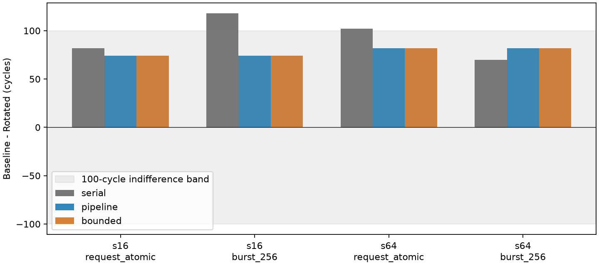
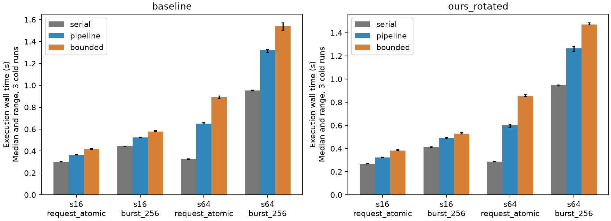

# WoW 设计收益预测：大部分绝对时间偏差在成对比较中抵消

2026-10-08，eex005。冻结执行内核，完成 24 个配置、72 次完整执行。
**本轮没有证明复杂边界模型对这组设计收益预测必不可少。**serial 对单个设计的
应用时间偏差仍可达约 4,000 cycles，但对 Baseline−Rotated 差距的误差仅为
8、44、20、−12 cycles，均满足预登记的 100-cycle 绝对误差预算。

这也不等于 serial 可以可靠宣布一个很接近的赢家：参考差距只有 74/82 cycles，
均在预登记的近似等效范围内；serial 在两格给出的 118/102 cycles 跨过了这条
决策边界。**差值误差通过、原始排序一致、阈值选型一致，是三个不同结论。**

pipeline 的全部应用时间及设计差距与 bounded 相同，但两种 placements 的 RX
容量都违反目标约束。因此它仍是时间预测诊断模型，不能作为可行执行的证明。

## 固定了什么，新增了什么

复用完整 s16/s64、TP8、direct-root、row-major、seed 1、原计算速率、共享内存
32 B/cycle 和每区域 256 KiB；2 TX/8 RX 槽仍从原预算扣除 20,000 B。两套内存
政策分别是 request_atomic、burst_256；在每套政策内比较 serial/pipeline/bounded。
所有网络均使用现有 native BookSim，不组合 packet 近似。

新增的是 Rotated 的 12 个配置。为取得同版本成本，Baseline 12 个控制也各运行
三次，且完整输入身份及执行事件与已接受的 memory-service-isolation-001 相同。
三次重复用于验证稳定性和计量，不算新的工作覆盖。研究代码只改编排、分析、
输出状态和入口文档；execution、architecture、adapters、workloads、patches、
third_party 的 Git tree identity 均冻结。

| 资源 | Baseline | Rotated |
|---|---:|---:|
| compute reticles / 本轮活跃 workers | 20 / 8 | 20 / 8 |
| routers | 124 | 100 |
| 无向 links | 232 | 226 |
| 总有向链路 bits/cycle | 7,424,000 | 7,232,000 |

两个完整设计没有匹配物理成本。row-major 规则相同，但端点集合/编号及物理位置
不同：逻辑 rank 顺序对应 Baseline `[0,1,2,3,4,5,6,7]`，Rotated
`[0,3,1,4,2,5,8,6]`。这不是只对同一端点集合重新排列，也不是搜索最优 mapping。
[Baseline 坐标与合同](inputs/baseline.json)、[Rotated 坐标与合同](inputs/ours_rotated.json)

计算、SRAM、DMA 槽数和 memory quantum 仍是声明的设计假设。bounded 是该合同
的机制参考，不是硅片真值；本结果不声称原生 Llama 时间、热证据或等成本优劣。

## 主表：绝对时间与设计收益分别看

单位为模拟 cycles；每个时间格为 **Baseline / Rotated**，差距为 B−R，正值偏向
Rotated。三次重复的完整执行记录一致。

| 完整工作 / 政策 | serial | pipeline | bounded | serial 差距 | 参考差距 | 差距误差 |
|---|---:|---:|---:|---:|---:|---:|
| s16 / request_atomic | 12,534 / 12,452 | 13,583 / 13,509 | 13,583 / 13,509 | 82 | 74 | +8 |
| s16 / burst_256 | 13,184 / 13,066 | 13,437 / 13,363 | 13,437 / 13,363 | 118 | 74 | +44 |
| s64 / request_atomic | 51,966 / 51,864 | 55,944 / 55,862 | 55,944 / 55,862 | 102 | 82 | +20 |
| s64 / burst_256 | 54,184 / 54,114 | 55,539 / 55,457 | 55,539 / 55,457 | 70 | 82 | −12 |

[model_decision_table.csv](analysis/model_decision_table.csv) 包含所有模型的 gap、
误差、原始排序、阈值决策和两边容量状态。四格 serial 原始排序均与参考一致，
但 s16/burst 和 s64/atomic 的 100-cycle 阈值分类不一致。它们距离边界太近，
不能把“误差小于 100”再解释成“分类必然正确”。100 cycles 是运行前声明的
决策预算，不是从这四格拟合的阈值，也不是统计置信区间。

## 偏差为何大部分抵消？

先看无需推测的配对误差：serial 相对 bounded 的 B/R 时间误差分别为
−1,049/−1,057、−253/−297、−3,978/−3,998、−1,355/−1,343 cycles。
于是 `E_gap = error_B − error_R`。主要绝对偏移在两台设计上相似，残差才进入
设计收益；不存在把约 7% 应用误差直接当作设计收益误差的依据。

既有独立 critical-chain 工具给出了相符的执行解释：在每一套政策、每种形状的
bounded 配对中，选定链的 compute、memory 和 source_queue 总量在 B/R 上相同，
network 部分分别为 s16 的 390/316、s64 的 254/172 cycles，恰好留下 74/82。
串行表示改变访存交错和消息暴露时刻，改变了链上的网络区间，但大部分本地
偏移依然对两种设计相同。s64/burst 的 serial 例外中，Rotated 链的 memory
多 32 cycles，network 少 102 cycles，合为 70-cycle 差距。

这是观测链的记账解释，不是互相独立的因果贡献；source_queue 也不改称纯网络
拥塞。不能据此推导优化上限。链、源端窗口和逐消息表均沿用既有工具，没有另建
归因执行器。[cells.csv](analysis/cells.csv)、[source_windows.csv](analysis/source_windows.csv)

**空间路径和接收服务并非没有变化。**例如 s16/burst 的同一逻辑消息
`attention_sum/phase/6`（4096 B）：serial 的 B/R 搬运服务为 1116/996 cycles，
目的 memory 排队为 720/648；实际路径为 B 的 `(2,35,32,6,21,22,0)` 与 R 的
`(1,22,20,0)`。在 bounded 参考中这条消息的 B−R 服务差为 472 cycles，serial
仅给出 120，相差 −352。这比应用 gap 的 44-cycle 误差大得多。

该消息至少位于一条所选观测链；这并不意味着其 352-cycle 差异会原样进入
应用结束。其他输入汇合、端口排队和后续工作会共同决定最终时间。完整配对
记录保留 ready-relative service、绝对 commit、源/目的服务等待及实际路由，
不能用一条消息的绝对时间偏移替代它的服务误差。
[paired_messages.csv](analysis/paired_messages.csv)

## 容量、语义与参考精度继续分开

| 工作 / 政策 | pipeline RX 峰值 B / R | bounded RX 峰值 B / R | 目标槽数 |
|---|---:|---:|---:|
| s16 / request_atomic | 18 / 19 | 8 / 8 | 8 |
| s16 / burst_256 | 16 / 17 | 8 / 8 | 8 |
| s64 / request_atomic | 60 / 61 | 8 / 8 | 8 |
| s64 / burst_256 | 63 / 63 | 8 / 8 | 8 |

当前公开摘要逐格列出 `execution_completed`、`semantic_audit_passed`、
`capacity_status`、`reference_agreement`、`hardware_calibration_status`，并保留
应用/消息各自的精度检查。审计通过表示记录符合该模式语义，不把无限 RX 的
诊断结果偷偷归为可行设计。serial 是 `unmodeled`，pipeline 为 `violated`，
bounded 为 `feasible`；后者的参考自比较标为 `reference`。本地硬件标定均为
`uncalibrated_local_resources`。旧审计 API 和接受结果没有改写。

## 同合同、同版本的成本

下表为执行阶段墙钟中位数，单位秒；每格三次冷进程、相同 CPU affinity、完整
日志，placements 交错、模型顺序轮换。初始化、图构建、序列化、审计另列。

| 工作 / 政策 / 设计 | serial | pipeline | bounded |
|---|---:|---:|---:|
| s16 / atomic / B | 0.301 | 0.366 | 0.421 |
| s16 / atomic / R | 0.266 | 0.323 | 0.383 |
| s16 / burst / B | 0.444 | 0.525 | 0.578 |
| s16 / burst / R | 0.413 | 0.490 | 0.530 |
| s64 / atomic / B | 0.324 | 0.650 | 0.894 |
| s64 / atomic / R | 0.288 | 0.602 | 0.852 |
| s64 / burst / B | 0.952 | 1.321 | 1.541 |
| s64 / burst / R | 0.945 | 1.264 | 1.471 |

这次 serial 在每个同机/同政策对照中成本最低，但省略了需要预测容量与消息时序
时的重要行为。三种模型使用相同日志政策，产生的事件数量可以不同。
图中误差棒是三次最小/最大值，不是置信区间；服务器负载保留在 LAUNCHES。
原生进程 CPU 为进程生命周期计量，不能精确分摊成各阶段；RSS 也是进程峰值。
[完整分阶段 wall/CPU/RSS](analysis/cost.csv) 不与旧日期或其他后端加速相乘。

## 本轮收束：什么模型用于什么判断？

| 需要判断的量 | 本轮模型选择 | 限定 |
|---|---|---|
| B−R 差距，允许 100-cycle 绝对误差 | serial 可作为最省成本的候选 | 四格通过；阈值附近保留“无法稳健区分”，不直接宣布赢家 |
| 声明流式机器下的应用时间 | pipeline 在这八个目标点与参考相同 | 它仍不代表有限 RX 的可行执行；不能推广到新工作 |
| 消息完整提交、有限接收容量 | 保留 bounded 机制参考 | 满足声明合同，不等于原生 wafer 标定 |
| 原生 WoW 训练时间或很小收益的经济价值 | 当前证据不足 | 两份小型 analytical block、未标定本地服务、未匹配物理成本 |

**当前设计问题的正式结论是：两种设计在声明的 100-cycle 范围内近似等效；
简化模型的主要时间偏移可以在设计差值中抵消。**现有数据没有证明必须保留有限
RX 反馈才能预测本轮应用设计差距，也没有因为容量违反而否定它对时间的数值吻合。
因此关闭这一轮边界增强与热点优化，保留现有三种模型及明确状态，不再扩展端点。

这是一项有适用范围的模型结论，不是已建立通用 simulator 新方法的宣称。
四格来自两份小工作、固定算法和映射；重复不能替代外部覆盖。若后续检验范围，
应另登记独立的工作/共享规模，例如两个固定 TP8 组同时执行，而不是继续在这
两个 block 中寻找一个新模块或逼出反转。本轮不启动那项验证。

## 验收、版本与复现

- 运行前源码 `31cca6a`：**163 项**语义/原生接口测试通过；完整 24-cell / 72-run
  矩阵通过，Baseline 12 格完整事件与旧证据一致。
- 独立分析 `5aca921`：**1,104 项**原产物哈希、72 次独立执行审计、**24 组**
  原生命令逐回复重放通过。重放是同一 native binary 的接口验证，不是硅片验证。
- 新增分析单独通过 **6 项**决策/状态/消息配对测试，含缺失参考消息拒绝；这些
  与前一测试集部分重合，不相加宣称 169 个独立测试。
- 图表整理 `eca79f5` 只重绘已保存表格，没有重跑应用。绘图数据及输出哈希在
  [FIGURES.json](figures/FIGURES.json)。

[运行身份](STARTED.json)、[完整清单](COMPLETE.json)、[原事件等价](COMPATIBILITY.json)、
[分析验收](analysis/ACCEPTANCE.json)、[分析哈希](analysis/ANALYZED.json)、
[运行前测试](SEMANTICS.json)、[分析测试](ANALYSIS_TESTS.json)。

远端目录均在 `/home/wangziheng/wafer_simulator/runs/`：
`boundary-design-001`、`boundary-design-analysis-001`、`boundary-design-tests-001`、
`boundary-design-analysis-tests-001`、`boundary-design-figures-001`。
大型事件、native 日志和重放留在 eex005；仓库收录紧凑表格、图及身份记录。
复现使用 [README 当前入口](../../../README.md#current-entry-point-eex005-only) 与
[预登记协议](../../BOUNDARY_DESIGN_PROTOCOL.md)，所有输出使用新目录。
