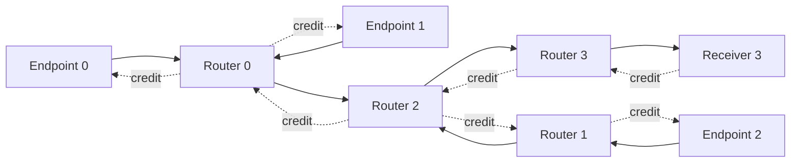

# G1 passed: independent causal closure on a four-router merge

Subsequent [audit repairs and strict re-readback](../causal-closure-audit-fix-001/REVIEW.md)
preserve every result below: seven saved cases pass, 19 real-data faults are
rejected, and the regenerated result bytes match this receipt.

The bounded G1 experiment is complete on hn072 (`ee4e072`). All seven cases
match the unchanged Native S executable without using its internal arrivals,
eligibility, grants, routes or credit timestamps as predictor inputs. Neighboring
local states generate data arrivals and reverse credits themselves. This closes
the external-boundary dependency of the earlier one-output reconstruction in
this declared component domain.

This result does not establish service compression, a general network backend,
application layout accuracy or hardware calibration. G2 and the application
matrix remain deferred; S/D0/D1 accepted predictions are unchanged.

## Explicit component and input boundary

The [registered contract](../../../configs/causal_closure.json) is a four-router
tree. Endpoints 0 and 1 first merge at R0; endpoint 2 enters R1. Both branches
merge at R2 and reach receiver endpoint 3 through R3. Every data channel has a
return-credit channel with the same declared latency.

The primary contract retains one private 32-flit VC, 64-byte single-flit
packets, one-iteration iSLIP, speedups one, non-speculative allocation,
VC/switch delays one, crossbar delay two, zero routing/credit-processing delay,
`wait_for_tail_credit=0`, `vc_busy_when_full=0` and the declared unbounded output
buffer. Router channels have latency 17; endpoint channels one. Routes are
unique on this tree. A separately labelled capacity-two case exercises credit
blocking; it is a diagnostic configuration, not a fitted replacement for 32.
This network component is not a new wafer organization.

[causal_merge.py](../../../src/wafer_sim/adapters/causal_merge.py) accepts only
external message source/destination/ready/flit count, the explicit contract and
a cycle limit. Unknown boundary fields and unsupported organizations/policies
are rejected. Every prediction is persisted before either Native process starts.
The comparator reads Native events afterwards. No old application trace or
empty-network calibration table enters prediction.

## Closed execution and comparison

Each source maintains a current message queue and pending messages. Router
inputs maintain FIFO heads; each forward output maintains its VC owner,
credit balance, VC/switch pointers and pending crossbar sends. Consumption at
a downstream input generates the upstream credit. Receiver consumption
creates the final return credit. Channel arrival includes the existing native
read/write phase boundary; propagation is not added after whole-message service.
Allocation decisions use pre-update ownership, so a switch send cannot free
its VC retroactively for allocation earlier in that cycle.

| Case | Capacity | Ready clocks | Predicted = Native message finishes |
|---|---:|---|---|
| Single flit | 32 | 0 | 50 |
| Single 1,024-flit response | 32 | 0 | 2,096 |
| Three-flow merge | 32 | 0 / 0 / 0 | 6,190 / 6,192 / 4,144 |
| Stagger 509 | 32 | 0 / 509 / 1,018 | 5,682 / 6,192 / 5,160 |
| Stagger 3,000 | 32 | 0 / 3,000 / 6,000 | 2,096 / 5,096 / 8,096 |
| Queued source: 64 / 17 / 81 flits | 32 | 0 / 0 / 0 | 302 / 370 / 372 |
| Tight-credit merge: 128 flits each | 2 | 0 / 0 / 0 | 7,499 / 7,501 / 5,005 |

[RESULTS.json](RESULTS.json) contains the raw-derived per-case checks. Across
17 messages and 10,787 flits, all 107,870 flit-field comparisons and 153
message-field comparisons match, including generation, injection, ejection,
first-router arrival, complete paths/link arrivals and message finish. All
97,083 local VC-commit/switch-commit/output-send clocks match. There are
112,695 allocation calls, each checked for requests, grants, pointers,
VC ownership, credit balance and FIFO heads/occupancy. Pre/post call inventories
also match, rejecting missing snapshots rather than silently comparing fewer.
All 43,148 returned credits and 32,361 router-sent credits match their complete
identity/time/count sequences. All seven final drainage clocks match.

Both upstream and downstream events are independently predicted. The
capacity-two case has 6,941 / 4,661 / 4,480 credit-blocked switch cycles at
R0/R1/R2, while the receiver router has zero. At capacity 32, simultaneous
merging already blocks R0/R1 for 2,023 / 1,959 cycles despite zero such blocking
at R2. G1 therefore exercises feedback and its influence on upstream demand;
it is not an open-loop experiment assuming credits are always available.
These are bounded component observations, not attribution of application gap
error or a universal sharing law.

## Internal boundaries remain distinct

[BOUNDARY_EXAMPLES.json](BOUNDARY_EXAMPLES.json) records two checked examples.
For the single flit, injection is cycle 0; R0 arrival/VC commit is 2, switch
commit 3 and send 5. R2 receives at 23, switches at 24 and sends at 26. R3
receives at 44, switches at 45 and sends at 47. The endpoint receives at 49;
message completion is boundary 50. The final reverse inter-router credit
arrives at 63, so the network drains at boundary 64.

For the queued source, message 0's last injection is 67. Message 1 is generated
at 68 but first injected at 69; message 0 only finishes at 302. Thus source
queue release, generation eligibility, first injection, destination completion
and final drain are separate computed events. Exact finishes do not hide a
source-boundary error in these registered cases. The earlier long common-source
study retains its own input/evidence; it was not rerun or rewritten here.

## Native observation and independent acceptance

Seven unmodified-S runs and seven isolated-observer runs complete: **14 full
Native component executions, zero applications**. The observer covers all four
forward outputs, endpoint ejection and processed/sent credits. It preserves
complete Native messages/flits, protocol bytes and final drain records in every
case. Patches are applied to isolated build copies; `third_party/`, the existing
Native client/executable, execution kernel and D0/D1 are unchanged.

[TESTS.json](TESTS.json) records 13 passing hn072 regressions at
`b150be72c6978d9a0f24ef350147043dbd04448b`, the campaign/build source.
[NEGATIVE_PROBES.json](NEGATIVE_PROBES.json) records seven real-data faults
rejected by the reusable [negative-check script](../../../scripts/check_causal_closure_negative_remote.py):
wrong arrival, wrong returned-credit clock, premature source generation,
a missing allocation snapshot with a consistent footer, wrong VC owner,
duplicated Native flit and a declared Native-boundary leak. These are seven
additional probes, not extra tests added to the 13-test suite.

[VERIFIED.json](VERIFIED.json) records fresh readback at
`f75dc5f04dd30ff51514f0818335fee3ed4fc7cd`: 156 campaign artifacts checked.
The reader regenerates predictions from registered external demand, compares
raw Native flits/sidecars and cross-checks saved summaries and per-case receipts.
Source hashes remain exact; no compatibility exception was needed. Readback
completion and G1 accuracy are separate flags, both true here.

Preparation failures remain visible. [The first test receipt](FIRST_FAILED_TESTS.json)
and [log](FIRST_FAILED_TESTS.log) contain one incorrect drain assertion: it
waited for the receiver credit but omitted the later inter-router return. Only
that expected boundary was corrected. An [initialization attempt](FAILED_INITIALIZATION.json)
failed before any flit because `time_limit`, a RapidChiplet orchestration field,
was passed to BookSim. It was removed from the config writer. That failed attempt
is not one of the 14 complete executions. No physical rates, arbitration
weights, routes, demand or prediction transitions were adjusted to match S.

The accepted S SHA256 remains
`d37fc5551d90adb03f2595f9e23ef0199b39be3a572f315ef154bad172d93beb`.
The accepted observer build SHA256 is
`f2a421a8e872079604e266430ed08d42c56c513bde281ab16da99e10482f9d25`.
[STARTED.json](STARTED.json) pins compiler, Python/packages, CPU affinity,
source files, registration, tests and build/binary identities.
[COMPLETE.json](COMPLETE.json) pins every campaign artifact;
[PUBLISHED_COPIES.json](PUBLISHED_COPIES.json) checks published bytes against
the server originals. Large event tables, predictions, sidecars and both build
attempts stay under `/Projects/haoning/wafer_simulator/{runs,build}`.
Old D1 component/application manifest hashes remain unchanged.

## Reproduction and scope

Use the [G1 protocol](../../CAUSAL_CLOSURE_PROTOCOL.md) with fresh directories
and same-source build/test receipts. Accepted campaign:
`runs/causal-closure-002`; final readback:
`runs/causal-closure-readback-003`; negative receipt:
`runs/causal-closure-negative-002`. The readback and negative-check commands
need no new Native execution.

G1 establishes independently composable local service for this fixed tree,
forward traffic, one VC, single-flit packets and one used output per router.
There is no competing other-output accept arbitration, adaptive route choice,
multi-VC state, endpoint receive backpressure or closed workload DAG here.
The predictor still advances cycles and flits. No event reduction, speedup,
100-cycle application-gap recovery, hardware accuracy, minimum-state proof
or method novelty is claimed. G2 can now be investigated against this closed
reference, but it has not been implemented or executed by this milestone.
