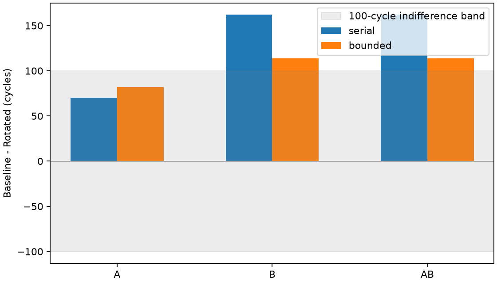
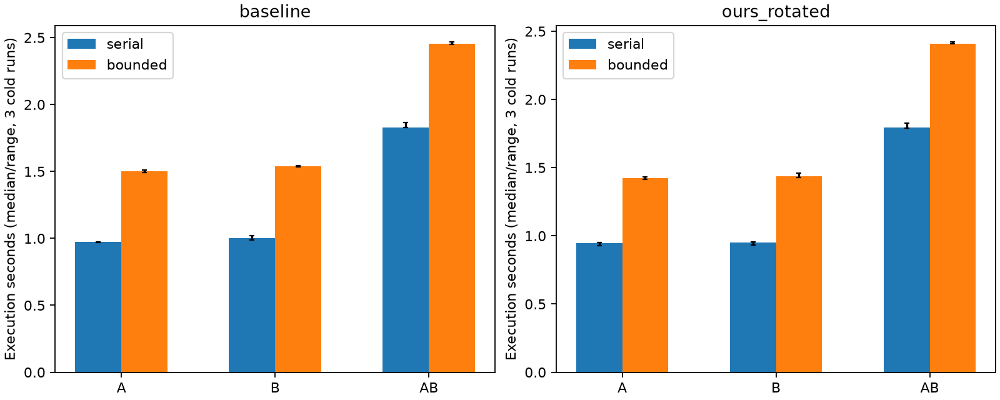

# 两组 TP8 共享 WoW：冻结模型的外部覆盖验证

本轮完成，不增加边界模型。沿用 `5de7a2f` 的执行内核、BookSim 二进制和
s64/burst_256 合同；只组合两份独立的完整工作。12 个配置、36 次完整运行在
eex005 完成。双组增加了实际共享路径和少量消息时序变化，**没有增加任一组
的最终完成时间**。serial 的双组设计差距误差为 **+48 cycles**，通过既定
100-cycle 预算。这扩大了已有用途的覆盖范围，没有证明高竞争场景也适用。

## 固定工作和目标

A/B 各运行一份完整 float32 Transformer forward block：batch 1、sequence 64、
hidden 64、heads 8、FFN 128、TP8，direct-root SUM、rank-local publication。
每组分别单跑，再在**一次执行器、一个 native BookSim 网络实例**里同时释放。
两组没有逻辑依赖或相互通信，计算与本地存储资源不同；物理网络仍然共享。
没有修改服务率、FIFO、路由、调度或 collective，没有寻找更有利的映射。

| Placement | A：row-major 前 8 个端点 | B：随后 8 个端点 |
|---|---|---|
| Baseline | 0,1,2,3,4,5,6,7 | 8,9,10,11,12,13,14,15 |
| Rotated | 0,3,1,4,2,5,8,6 | 9,7,10,13,11,14,12,15 |

原位置、源 SRAM、256-byte memory burst、32 B/cycle 共享读写端口、计算服务率、
2 TX/8 RX slots 和 seed 均固定。FIFO 从原 256 KiB/region 中扣除。消费者仍等
完整对象写入后启动。两种设计的资源不同：124/100 routers、232/226 无向 links；
这不是等物理成本比较。本地资源依旧是声明假设，不是原生 WoW 硬件标定。

双组完整工作包含 228 个操作、56 条消息、917,504 有效网络 bytes、504 个 flits，
memory service 为 8,470,528 bytes；均等于两份单组的和。两组共激活 16/20 个
端点。单组是双组 DAG 和物理绑定的精确投影，没有截断输入或删依赖。

## 完成时间和设计差距

单位为模拟 cycles。差距定义为 Baseline − Rotated；bounded 是本合同机制参考。

| 场景 | serial B / R | bounded B / R | serial 差距 | 参考差距 | 差距误差 |
|---|---:|---:|---:|---:|---:|
| A 单跑 | 54,184 / 54,114 | 55,539 / 55,457 | 70 | 82 | −12 |
| B 单跑 | 54,306 / 54,144 | 55,743 / 55,629 | 162 | 114 | +48 |
| A+B 同时 | 54,306 / 54,144 | 55,743 / 55,629 | 162 | 114 | +48 |

两个模型、两种 placement 中，A 和 B 的最终 output-ready 与 retirement 相对
各自原位置单跑的变化都是 **0 cycles**。双组总时间等于较慢 B 组的时间；
不是把两个单跑时间相加。A 单跑去掉命名空间后，四格完整事件与旧结果完全一致。

对双组，serial 分别低估 1,437/1,485 cycles（2.578%/2.669%），不满足既定
绝对时间精度条件；两个偏差相减只剩 48 cycles。因此它仍适合本范围内的
100-cycle **设计差距粗估计**。B/AB 的参考差距 114 cycles 仅比 100-cycle
近似等效边界高 14 cycles：相同的点估计分类不等于带误差保证的稳健赢家判断。

## 有共享资源，但没有最终慢下来

以下计数来自双组**实际 flit 路径**，不是拓扑最短路推测。

| Placement / 模型 | 两组共同使用的有向 links | 共同 routers | 56 条消息中提交时间改变的条数 | ready-to-commit 变化范围 |
|---|---:|---:|---:|---:|
| Baseline / serial | 2 | 2 | 7 | −8 至 +48 cycles |
| Baseline / bounded | 2 | 2 | 13 | −361 至 +80 cycles |
| Rotated / serial | 0 | 1 | 0 | 0 |
| Rotated / bounded | 5 | 4 | 1 | +1 cycle（其余为 0） |

例如 Baseline bounded 的 A/attention_sum/phase/22 提交提前 361 cycles，
但 A 的所有操作 ready/admission/retirement 时间仍与单跑相同：内部消息时间
变化没有越过后续执行的完成条件。两个 AllReduce 的 ready/retirement 在单跑
和双组中均一致。Rotated bounded 只有 A/r4/output 启动和完成推迟 1 cycle，
该输出仍早于该组最后输出，因此也没有增加组完成时间。

Baseline serial/bounded 分别有 1/2 条消息的逐路径 flit 数量发生变化。
模型保持自适应路由与原仲裁；这些差异是共享网络执行中的路径和服务顺序变化，
不能把每个时间变化唯一归因于某条链路拥塞。相同链路的到达时间范围重叠，
也不等于链路持续满载。bounded 首 flit 供数完成后的最大注入等待仍为 0；
当前没有网络饱和的证据。不同模型的活动路径数量不同，也不能直接解释为
某个模型拥有更多物理链路。

双组最终关键链落在 B。serial 的 B−R 记账差为 memory 80 + network 82 =
162 cycles；bounded 为 network 114 cycles，其他类别之差为零。
这是观测关键链的分解，不是各资源独立干预的因果贡献。source_queue 分类
仍是聚合的等待记账，没有在这一轮展开或替换它。

bounded 全部六格 RX 峰值不超过 8，TX 不超过 2；逐包字节、写入、信用和存储
生命周期审计通过。serial 的 RX 状态继续标为 **unmodeled**，不用于容量认证。

## 相同计量口径下的成本

两种模型均使用完整 native 协议和事件日志，相同源码和 CPU affinity 254/255，
每格三个新进程，交替 placement 与模型次序。以下为执行阶段墙钟中位数：

| 场景 | Baseline serial / bounded，秒 | Rotated serial / bounded，秒 |
|---|---:|---:|
| A 单跑 | 0.974 / 1.502 | 0.945 / 1.425 |
| B 单跑 | 1.003 / 1.537 | 0.951 / 1.438 |
| A+B | 1.829 / 2.456 | 1.795 / 2.410 |

双组的 bounded/serial 执行成本比约 1.34×。这属于不同模型的实测成本，不是
新的实现加速，也不与旧版本优化倍数相乘。双组图构建约 0.030–0.032 s，初始化
约 0.372–0.373 s，结果序列化约 0.104 s，独立审计约 0.43–0.44 s，均另计。
Python lifetime peak 约 104–106 千 KiB；native peak 约 10.7–11.6 千 KiB。
完整 CPU、RSS、阶段中位数与范围见 [costs.csv](analysis/costs.csv)。

本轮只测冷启动；没有宣称初始化复用收益。driver_launch_and_receipt_checks
包含父进程回读/兼容检查，不当成纯后端时间。子进程 CPU 在退出时归账，不把
execution 阶段尚未退出的 child CPU 零值解释为原生执行免费。服务器没有独占，
记录的 1-minute load 为 7.95–9.70；这些是本批次的成本观测。

## 决定与证据

**保留现有模型选择，继续冻结边界增强。**serial 的指定差距用途在新增 B 位置
及双组场景中仍通过；bounded 保留为提交时序与有限容量参考。本轮有实际空间
共享、消息差异，但没有组级 slowdown，因此不能将这一结果推广到强干扰或
饱和条件。它是一个可接受的有限范围负结果，不再通过更换映射或参数制造失败。

没有新增完整 Llama、Chakra 恢复、NoC、FIFO、thermal 或加速机制。

- 运行源码：`de3a49e`；最终分析：`62d5166`。
- 运行前 170 项语义/native 接口测试通过；最终 171 项通过（含新增分析回归），
  两者不相加。见 [运行前回执](SEMANTICS.json) 和 [最终回执](FINAL_SEMANTICS.json)。
- 36 次完整执行独立回读，555 项原始产物哈希；12 个配置的 native 命令回放
  通过；三次重复的完整事件一致。见 [ACCEPTANCE](analysis/ACCEPTANCE.json)。
- 原始运行与全部事件：eex005 `runs/group-sharing-001`（约 474 MiB）。
  最终分析：`runs/group-sharing-analysis-002`；此前分析保留为 `001`。
  表中的逐消息结果可从最终目录 `paired_messages.csv` 回读。
- 单组工作、映射投影与旧结果检查见 [COMPATIBILITY](COMPATIBILITY.json)。
  全部原有 workloads/adapters/architecture/execution/third_party/patches 文件
  与 `5de7a2f` 相同；只新增命名空间和分组绑定两个小 helper。
- [COMPLETE](COMPLETE.json) 与 [ANALYZED](analysis/ANALYZED.json) 保留远端
  大文件哈希，不表示这些大文件已下载。源、环境和构建身份见 [STARTED](STARTED.json)。
- [登记协议](../../GROUP_SHARING_PROTOCOL.md)、[决策表](analysis/decision_table.csv)、
  [逐组变化](analysis/group_interference.csv)、[共享资源](analysis/shared_resources.csv)。
