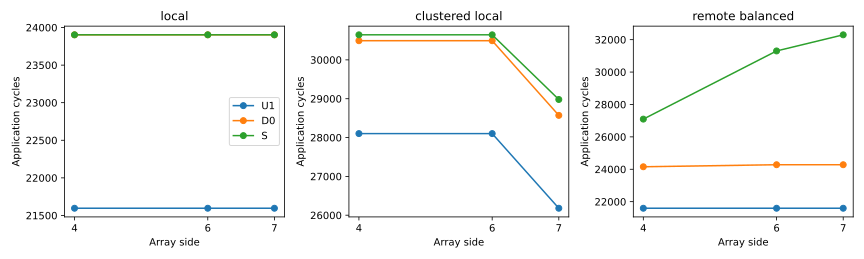
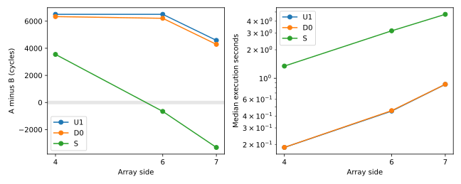

# Accurate independent service still misses the A/B layout crossover

D0 restores unloaded physical-path service and the Local layout's application
time, but **still chooses B instead of A at 6×6 and 7×7**. Single-flow calibration
reduces application MAPE from U1's 15.517% to **6.724%**, without recovering the
primary locality-versus-controller-balance judgment or its 100-cycle gap budget.
This is a stronger test of independent communication than the original U1:
every required DRAM endpoint/payload has an independently checked component cost.

Accepted on hn072 (`ee4e072`), using the unchanged native binary and frozen
machine/work/U1/S/execution semantics. **1,700 component conditions, 3,460
singleton captures, 81 complete application executions, 27 native command
replays and 209 semantic/interface tests passed.** Independent readback checked
41,524 component artifact hashes and 1,247 application artifact hashes. All
18 U1/S cells reproduce the accepted full-event hashes; every cell's three
fresh-process repetitions produce identical execution hashes. All executions
have zero capacity-admission wait.

## Calibration and prediction boundary

The [registered protocol](../../INDEPENDENT_SPATIAL_SERVICE_PROTOCOL.md) generates
DRAM tuples from physical machines, complete DAGs and fixed layout rules before
application execution. Each tuple runs on a fresh empty network at ready clocks
0 and 137. The 60 supplemental size/path conditions also pass an independent
ready-clock holdout at 509. These holdouts test clock translation, not unseen
payload/path extrapolation.

Sizes 1, 16, 63, 64, 65, 128, 256, 4,096, 16,384 and 65,536 bytes cover rounding,
short control messages and long responses across 0–5 C2C hops plus HB. On the
zero-C2C path, measured complete service is 13 cycles for 1–64 bytes, 15 for
65/128, 19 for 256, 139 for 4,096, 523 for 16,384 and 2,059 for 65,536. Long
response injection span is 1,987 cycles, rather than an always-two-cycle
inter-flit sequence. See [component measurements](analysis/components.csv).

The 1,700 measured conditions are consistent with
`2*ceil(bytes/64) + 11 + 21*C2C_hops` on these networks. This is an empirical
relationship over the checked domain, not a hardware law or validation of
unseen configurations. D0 retains exact table lookup and fails on unsupported
machines/endpoints/sizes. In particular, `ceil(bytes/32)` would not preserve
short-message rounding. The [table](calibration/TABLE.json) contains isolated
component paths and capture hashes; it contains no full-S application routes,
readiness times, message overlaps or fitted application timings.

D0 preserves U1's banks/controllers, admission, staging lifetime, complete work
and native C2C/IO. Each DRAM completion is scheduled independently from its own
ready clock. No DRAM endpoint/link sharing or traffic-history state is retained;
sharing between DRAM and native C2C/IO is also omitted. Source/config/topology
and binary identities are checked before prediction and on independent readback.

## Application and layout results

All values are simulated cycles. A is `clustered_local`; B is
`remote_balanced`. No placement or bandwidth was adjusted after calibration.

| Array | Layout | U1 | D0 | S | D0−S |
|---|---|---:|---:|---:|---:|
| 4×4 | Local | 21,596 | 23,903 | 23,903 | 0 |
| 4×4 | A | 28,102 | 30,493 | 30,645 | −152 |
| 4×4 | B | 21,596 | 24,155 | 27,096 | −2,941 |
| 6×6 | Local | 21,596 | 23,903 | 23,903 | 0 |
| 6×6 | A | 28,102 | 30,493 | 30,645 | −152 |
| 6×6 | B | 21,596 | 24,281 | 31,303 | −7,022 |
| 7×7 | Local | 21,596 | 23,903 | 23,903 | 0 |
| 7×7 | A | 26,180 | 28,571 | 28,980 | −409 |
| 7×7 | B | 21,596 | 24,281 | 32,298 | −8,017 |

D0 passes the 2% application budget in all six Local/A points and fails in all
three B points. Its worst application error is 24.822%, versus U1's 33.135%.
Equal Local makespans do not mean D0 reproduces native flit events.

For the primary pair, positive A−B means B wins:

| Array | S A−B | U1 A−B | D0 A−B | D0 gap error | D0 choice |
|---|---:|---:|---:|---:|---|
| 4×4 | +3,549 | +6,506 | +6,338 | +2,789 | B, correct direction |
| 6×6 | −658 | +6,506 | +6,212 | +6,870 | B, wrong direction |
| 7×7 | −3,318 | +4,584 | +4,290 | +7,608 | B, wrong direction |

All primary gap errors exceed the unchanged 100-cycle budget. Calibration
reduces U1's signed primary gap errors by only 168 / 294 / 294 cycles; these
are differences between model predictions, not independent causal contributions
to application time. D0 also fails the magnitude budget for all nine layout
pairs, while matching direction in seven of nine.

There is a useful partial success: **D0 selects Local alone as the global best
among all three layouts at every size**, with zero candidate-set reference
regret. It removes U1's Local/B false tie and its possible B penalties of
3,193 / 7,400 / 8,395 cycles. Thus single-flow calibration matters for absolute
timing and some choices, even though it cannot restore the registered A/B
tradeoff. See [all pairs](analysis/design_gaps.csv) and
[candidate sets and accuracy](analysis/SUMMARY.json).

## Same-message service, separate from makespan

For 6×6 B's `first17/phase/4`, the payload/endpoints are unchanged:

| Model | Own ready clock | Ready-to-completion cycles |
|---|---:|---:|
| U1 | 3,118 | 1,035 |
| D0 | 3,182 | 2,122 |
| S | 3,182 | 6,177 |

The already accepted same-message decomposition is therefore preserved:

`6177 − 1035 = (2059 − 1035) + (2122 − 2059) + (6177 − 2122)`

`5142 = 1024 + 63 + 4055`.

D0 accounts for the basic single-flow discrepancy and three C2C hops. The
remaining 4,055 cycles are conditional on the original background/history.
They are not assigned solely to the two observed peers, a credit mechanism,
a buffer or arbitration, and are not added as an independent makespan effect.

## Measured cost and limits

Three fresh processes per cell, rotated model order, affinity CPUs 18/19 and
the same host/logging policy. Ranges below span cell medians over three layouts.
RSS columns give the largest cell-median Python / native lifetime peak observed
at execution end; they are separate processes and exclude later audit peaks.

| Array | U1 execution s | D0 execution s | S execution s | D0 peak MiB | S peak MiB |
|---|---:|---:|---:|---:|---:|
| 4×4 | 0.159–0.193 | 0.182–0.196 | 1.058–1.664 | 93.0 / 25.3 | 144.8 / 133.0 |
| 6×6 | 0.450–0.495 | 0.448–0.481 | 2.796–4.648 | 101.9 / 56.3 | 242.3 / 329.6 |
| 7×7 | 0.763–0.903 | 0.833–0.894 | 4.283–9.225 | 110.4 / 78.4 | 315.1 / 423.0 |

Paired S/D0 execution-median ratios range from 4.95 to 10.32. D0 still executes
native C2C/IO and logs 4,353 / 9,473 / 12,801 native flits, while S also logs
all DRAM flits. This is reduced modeled work, not identical detailed work
executed faster. All preparation, initialization, serialization/audit phases
and CPU costs are in [costs.csv](analysis/costs.csv). Host load was recorded;
the server was not claimed exclusive.

Calibration alone took **628.031 seconds** for 3,460 probes, with a 91.7 MiB
Python lifetime peak and a **1,694,921-byte table**. This cost precedes prediction
and is amortized only while reusing this calibrated domain. These ratios do
not claim a cheaper end-to-end one-off campaign including calibration.

The result justifies evaluating a lightweight model of time-dependent shared
spatial service for this frozen A/B decision: accurate independent service is
insufficient. It does not establish which shared state is minimal, that all
BookSim router states are necessary, hardware accuracy, thermal effects,
equal physical cost or method novelty. No U2 was implemented in this milestone.

## Provenance and failed attempt

Calibration capture source: `213e5c3`; application/readback source: `fb90869`.
The initial application attempt passed D0 completion audit but failed critical
chain analysis because its new backend name was missing from the analysis
dispatch. `fb90869` adds that analysis support and a regression test. The
capture reader records original/current hashes for its own correction and
critical-chain analysis, verifying archived source bytes; all calibration and
prediction code remains byte-identical. No component service was retuned.

Remote evidence is under `/Projects/haoning/wafer_simulator/runs/`:
`d0-calibration-001`, `d0-applications-002`, `d0-analysis-001`, `d0-tests-004`.
`d0-applications-001` retains its failure receipt and has no completion receipt.
The first interpreter probe (`d0-tests-001`) failed from missing base-environment
dependencies; successful tests use the project's `.venv`.

Large full-flit captures, protocol logs, inputs and build products remain on
hn072. This directory retains the compact table, manifests, measurements and
independent [verification](analysis/VERIFIED.json). The previously accepted
scaling summary was copied after matching its original manifest SHA-256
`9a5bff154a6aee0580df2bd2f81b54ea66e69b6eb2421e1cae7a8e36ca942f71`;
it is used solely for U1/S event-equality checks.
