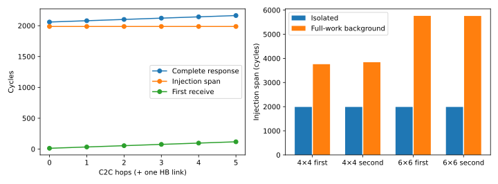

# Long-response mechanism: distance alone does not explain the injection slowdown

Accepted on hn072 (`ee4e072`), 2026-10-09. **In this fixed configuration,
increasing an isolated response from zero to five C2C hops does not lengthen
its injection span. The much longer spans in the full workload require the
background network state and shared traffic.** Actual flit records locate
overlapping responses on the critical C2C outputs. This closes the registered
mechanism test; no U2, network model, hardware parameter or application run was
added to the frozen [27-cell scaling study](../spatial-scaling-001/REVIEW.md).

## 1. Fixed controls and evidence

The [protocol](../../ISOLATED_RESPONSE_PROTOCOL.md) and
[configuration](../../../configs/isolated_response.json) were committed before
execution. The primary six conditions use the same complete 6×6 graph, source
`dram-0-0`, and destinations `sram-(6*h)` for h=0..5. Every actual flit follows
one HB link and h C2C links on the same column. The four matched conditions
retain the accepted 4×4/6×6 critical responses' endpoints, bank identity,
payload, original eligibility cycle and complete graph; only other traffic
and its historical network state are removed.

Each response is 65,536 bytes: 1,024 single-flit packets of 64 bytes, all
eligible together. Each link offers one flit/cycle. Settings remain one VC,
32-flit VC capacity, non-speculative allocation, one-cycle VC and switch
allocation, two-cycle final traversal, C2C link latency 17, HB latency 1,
endpoint access latency 1, seed 1. No memory service is measured in this probe:
it starts when the full response is eligible. It is not a truncated application.

Two fresh processes per condition give **20 complete responses**, with equal
repeated flit events, drained termination and **10 exact native command replays**.
The independent reader checked all 20 responses and **303 artifact hashes**,
including the saved configurations, paths and selected old workload evidence.
The supporting remote suite passed **199 tests**. See [COMPLETE](COMPLETE.json),
[VERIFIED](analysis/VERIFIED.json), [SEMANTICS](SEMANTICS.json) and
[STARTED](STARTED.json) for scope, source, binary, environment and input identities.

## 2. Isolated path length changes startup and drain, not injection rate

All times below are cycles relative to eligibility. Receive times use the
consumer-visible boundary, native ejection cycle + 1. Injection span is last
minus first injection, without an extra cycle.

| C2C hops (+ one HB) | First receive | Last receive / complete response | Injection span | Middle-half injection, B/cycle |
|---:|---:|---:|---:|---:|
| 0 | 13 | 2,059 | 1,987 | 32 |
| 1 | 34 | 2,080 | 1,987 | 32 |
| 2 | 55 | 2,101 | 1,987 | 32 |
| 3 | 76 | 2,122 | 1,987 | 32 |
| 4 | 97 | 2,143 | 1,987 | 32 |
| 5 | 118 | 2,164 | 1,987 | 32 |

First injection wait is zero in every condition. Each additional C2C hop adds
21 cycles, consistent with the fixed 17-cycle link and four-cycle router
service. The complete observed responses obey `2059 + 21*h` **within these
six conditions**. This is a component observation, not a proposed application
model or a universal path formula.

Nominal link capacity is not the measured single-flow rate. All six traces have
59 one-cycle and 964 two-cycle inter-injection gaps. The finite injection rate
is 65,536 / 1,988 = 32.966 B/cycle; the middle-half rate, measured between flits
256 and 768, is 32 B/cycle. The finite completion rate declines from 31.829 to
30.285 B/cycle because startup/drain grow. It would be incorrect to describe
that decline as a lower sustained injection rate or to assume 64 B/cycle of
usable single-message service from link capacity alone.

## 3. Restoring the original background changes sustained service

The matched probes use the exact endpoints, eligibility times and actual paths
of the original B-layout responses. Paths contain two C2C links at 4×4 and three
at 6×6. No alternate-route change explains the comparison. Detailed rates and
tails are in [matched.csv](analysis/matched.csv).

| Original response | Isolated duration | Full-work duration | Background duration excess | Isolated span | Full-work span | Full-work middle-half B/cycle |
|---|---:|---:|---:|---:|---:|---:|
| 4×4 `first11/phase/4` | 2,101 | 4,129 | 2,028 | 1,987 | 3,760 | 16.000 |
| 4×4 `second11/phase/7` | 2,101 | 4,142 | 2,041 | 1,987 | 3,842 | 16.000 |
| 6×6 `first17/phase/4` | 2,122 | 6,177 | 4,055 | 1,987 | 5,762 | 9.427 |
| 6×6 `second17/phase/7` | 2,122 | 6,171 | 4,049 | 1,987 | 5,758 | 9.449 |

First injection wait remains zero in both columns. The effect develops during
the response, not before its first flit. Isolated middle-half rates remain
32 B/cycle in all four cases. Tail time after the last injection also changes:
114 → 369/300 cycles at 4×4 and 135 → 415/413 at 6×6.

From 4×4 to 6×6, the first critical response grows by 2,048 cycles and the
second by 2,029. Matched isolation adds only 21 cycles to each. The difference
in their background excess is therefore 2,027 and 2,008 cycles respectively.
This is observed/counterfactual message accounting. It does **not** say removing
background saves their sum from application time: that intervention changes
other messages, dependencies and possibly the critical chain. The old
4,207-cycle critical-network increase is not a new application result here.

## 4. Temporal link sharing locates the relevant spatial interaction

The table counts actual flits on a directed physical link during the target
message's first-to-last arrival window on that link. Each target contributes
1,024 flits. Peer counts are within that window, not their whole-message size.
Router IDs are preserved in the [full summary](analysis/SUMMARY.json).

| Target response | Shared compute link | Arrival window | Other response flits | Peer identities | Total activity, flits/cycle |
|---|---|---|---:|---|---:|
| 4×4 first11 | c7 → c11 (14 → 22) | 3,211–7,283 | 1,013 | first15/phase/4 | 0.5001 |
| 4×4 second11 | c4 → c8 (8 → 16) | 16,217–20,303 | 1,020 | second7/phase/7 | 0.5001 |
| 6×6 first17 | c23 → c17 (46 → 34) | 3,276–9,352 | 2,015 | first11/phase/4: 1,013; first5/phase/4: 1,002 | 0.5001 |
| 6×6 second17 | c12 → c18 (24 → 36) | 18,409–24,475 | 2,010 | second23/phase/7: 1,012; second29/phase/7: 998 | 0.5001 |

Thus a critical output carries the target and one other response at 4×4,
versus the target and two others at 6×6. The source HB links have **zero peer
flits in the corresponding windows**, although injection there slows. Together
with the matched isolation, this supports downstream sharing and feedback as
the cause class, rather than source-HB traffic sharing or a distance-only
single-flow rate loss. Intermediate merge timing matters; the 6×6 middle rate
is not a demonstrated fair division of 32 B/cycle among three flows.

The roughly 0.5 flit/cycle activity is below the nominal one-flit/cycle link
capacity. Neither this window nor low whole-run link utilization establishes
nominal network saturation. Conversely, low whole-run utilization and zero
first-flit waiting do not exclude delay from temporally overlapping traffic.

## 5. Mechanism supported by the implementation, and its limit

The pinned native implementation provides a specific feedback path:

- `TrafficManager::_Step` in
  [trafficmanager.cpp](../../../third_party/nw-design-for-wsi/rapidchiplet/booksim2/src/trafficmanager.cpp)
  gates injection on VC availability and downstream buffer space.
- `BufferState::SendingFlit` and `ProcessCredit` in
  [buffer_state.cpp](../../../third_party/nw-design-for-wsi/rapidchiplet/booksim2/src/buffer_state.cpp)
  charge occupancy at send and release it when credits return. Setting
  `wait_for_tail_credit=0` does not remove capacity credits.
- `IQRouter::_SWAllocUpdate` in
  [iq_router.cpp](../../../third_party/nw-design-for-wsi/rapidchiplet/booksim2/src/routers/iq_router.cpp)
  returns a credit on dequeue and sends the next single-flit packet through
  allocation. The configured one-VC, non-speculative pipeline is consistent
  with the observed two-cycle middle injection interval even without peers.

These code paths explain how downstream service can constrain upstream
injection. We did not add credit-stall counters or vary VC/buffer/allocation
parameters. Consequently we do not uniquely partition the extra cycles among
credit delay, arbitration, buffering and previous traffic, or experimentally
attribute the isolated 32 B/cycle to one of those knobs. Isolation removes all
background and its history together. It does not identify a particular peer's
individual causal contribution.

## 6. Model decision and stop

The distance-only explanation is insufficient for these long-response changes.
A future lightweight spatial candidate must at least confront **effective
single-flow service, actual shared paths and overlapping demand**. Adding a
fixed cost per hop while treating messages independently cannot explain the
matched background excess. This motivates testing a shared spatial service
approximation; it does not yet prove which queue/credit states are sufficient
or justify reproducing the complete native router.

No U2 was implemented. The machine, workload, 27 accepted scaling cells and
native binary remain frozen. U1 is our defined aggregate baseline, not a claim
about every prior simulator. The A/B error concerns that restricted candidate
pair; Local remains best among the three tested layouts. The 6×6 gap remains
sensitive to uncalibrated resource assumptions, and 7×7 edge clustering was not
isolated by this experiment. This result establishes a mechanism boundary, not
hardware accuracy, a new architecture winner or an application speedup.

## Reproduction and provenance

Run source: `1e2da11`; independent analysis: `76adfc9`. The latter corrects JSON
integer histogram keys during readback; it changes no simulated events. The
first analysis attempt did not produce acceptance. Analysis `002` is the
accepted full readback; no native rerun was needed for that reader correction.

Raw data stay under `/Projects/haoning/wafer_simulator/runs/`:
`isolated-response-001`, `isolated-response-tests-001` and
`isolated-response-analysis-002`. The native SHA-256 is
`d37fc5551d90adb03f2595f9e23ef0199b39be3a572f315ef154bad172d93beb`,
identical to the scaling reference. Compact CSV, figures, receipts and reports
are delivered here; per-flit events remain on hn072.

The [README entry](../../../README.md#current-entry-point-hn072-only) runs this
protocol with fresh output directories. Independent analysis can also be run
alone against the preserved `isolated-response-001` directory; it does not
launch applications or BookSim. [VERIFIED](analysis/VERIFIED.json) hashes each
archived analysis artifact; publication checks and release tests are recorded
separately in `PUBLISHED.json`.
