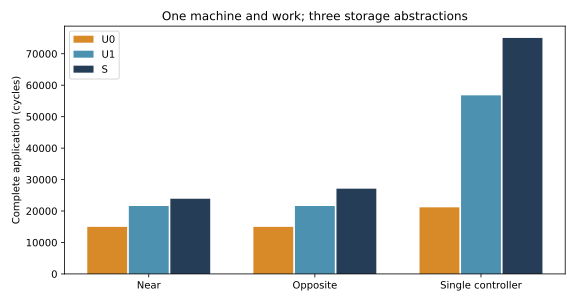
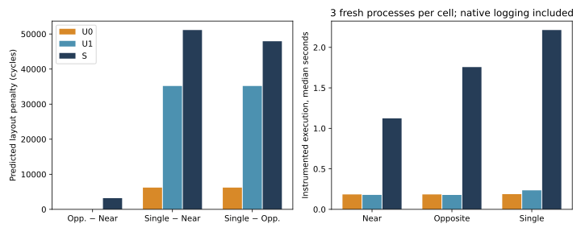

# Spatial storage matters for layout discrimination under this machine contract

Accepted on eex005, 2026-10-09. The 9 registered model/layout cells completed
54 full executions. Independent readback checked all 54 executions and 840
artifact hashes; all 9 native command replays passed. The 192 related tests
passed before execution. All three S event hashes exactly reproduce the
accepted `592d327` machine results. No execution-kernel, workload, physical
machine, pinned source, patch or native binary changes were made.

**Result:** controller-aware uniform communication can identify concentrated
storage as slower, but cannot distinguish the nearby and remote distributed
layouts. Both U0 and U1 return a tie where S predicts a 3,193-cycle difference.
They also substantially underestimate the concentrated layout's penalty.
This is evidence about these declared abstractions relative to a conditional
mechanism reference, not measured hardware accuracy or a complete simulator
paper contribution.

## Fixed target and the actual abstractions

The [pre-run protocol](../../MEMORY_ABSTRACTION_PROTOCOL.md) and
[registration](../../../configs/memory_abstraction.json) freeze the same 4×4
compute-plus-memory wafer, 16 workers, 32 GEMMs, task placement, seed, capacities,
rates and whole-operation staging policy. Only bank homes differ between
layouts. Within each layout all three models share an identical original
physical-input hash. Every execution contains 16,777,216 MACs, 114 logical
messages and 2,638,608 message bytes including control; no work is removed.

| Model | Storage abstraction | DRAM communication |
|---|---|---|
| U0 | Pooled DRAM capacity, bank/channel/command service; **physical staging guards retained** | Independent uniform cost |
| U1 | Original banks, controllers, service and capacity | Same independent uniform cost |
| S | Original spatial resources | All traffic in live BookSim |

U0 has one 2 GiB aggregate DRAM region, one 1024 B/cycle bank resource and one
1024 B/cycle channel resource. Command service sums to 64 control B/cycle;
each request still rounds up to an integer cycle. These are sums of the same
physical budgets, not extra resources allocated per requester. All 16 separate
controller staging capacities, reservation amounts and retirement release
rules remain. **U0 is not entirely location-blind:** concentration can still
hurt through this common staging guard. Its aggregate-capacity audit does not
certify per-bank capacity.

Uniform DRAM transfer time is the registered unloaded one-HB estimate:
`ceil(bytes/64) + 11 cycles`. It is derived from the declared access/router/HB
parameters, not fitted to S. Requests, payload responses, writes and acks remain
separate actions; compute/SRAM/host services and C2C/host BookSim traffic remain.
Replaced DRAM messages do not consume native endpoint/link resources. Their
records are labeled estimates and contain no invented physical flit paths.

Consequently U1–S changes distance **and** spatial sharing, native injection,
flow control and route behavior. This experiment does not isolate distance
from every other network mechanism. It does isolate storage resource pooling
(U0–U1) from the common communication approximation.

## Application and design-selection error

All values below are simulated cycles. S is the reference for the declared
policy, not a silicon measurement.

| Data layout | U0 | U1 | S | U0 error | U1 error |
|---|---:|---:|---:|---:|---:|
| Near | 14,963 | 21,596 | 23,903 | −37.40% | −9.65% |
| Opposite | 14,963 | 21,596 | 27,096 | −44.78% | −20.30% |
| Single controller | 21,167 | 56,775 | 75,032 | −71.79% | −24.33% |

Across the three layouts, application MAPE is 51.32% for U0 and 18.09% for U1.
Neither approximation meets the registered 2% application budget in any layout.

| Layout penalty | U0 | U1 | S | U0 penalty error | U1 penalty error |
|---|---:|---:|---:|---:|---:|
| Opposite − Near | 0 | 0 | 3,193 | −3,193 | −3,193 |
| Single − Near | 6,204 | 35,179 | 51,129 | −44,925 | −15,950 |
| Single − Opposite | 6,204 | 35,179 | 47,936 | −41,732 | −12,757 |

Both simple models disagree with S on **one of three pairwise relations**:
near versus opposite. They correctly put the concentrated layout last. Neither
predicts a strictly wrong winner; both fail to distinguish two candidates.
Using the preregistered 100-cycle near-equivalence band, their candidate set is
`{near, opposite}`, whereas S selects `{near}`. The reference regret of choosing
from the simple models' set spans **0–3,193 cycles**, or up to about 13.36% of
S's best time. Do not break the tie by consulting S and then report zero error.
All six non-reference gap estimates exceed the 100-cycle error budget.

These are concrete layout-selection and benefit-estimation failures. They do
not establish that every possible uniform model fails, or that any empirical
constant was calibrated to this target. In particular, S's nearby timing also
differs from the unloaded communication estimate.

## What accounts for the errors?

The observed service-chain decomposition closes exactly to each makespan:

| Layout | Model | Compute | Memory | Network | Capacity wait |
|---|---|---:|---:|---:|---:|
| Near | U0 | 4,096 | 7,381 | 3,486 | 0 |
| Near | U1 | 4,096 | 14,014 | 3,486 | 0 |
| Near | S | 4,096 | 14,014 | 5,793 | 0 |
| Opposite | U0 | 4,096 | 7,381 | 3,486 | 0 |
| Opposite | U1 | 4,096 | 14,014 | 3,486 | 0 |
| Opposite | S | 4,096 | 12,902 | 10,098 | 0 |
| Single controller | U0 | 4,096 | 7,165 | 3,020 | 6,886 |
| Single controller | U1 | 6,144 | 38,536 | 4,561 | 7,534 |
| Single controller | S | 4,096 | 37,478 | 9,411 | 24,047 |

For distributed storage, U1 and S have no queued compute/memory service requests
in these runs. Removing physical DRAM communication makes near and opposite
indistinguishable. In S, opposite placement changes actual paths and message
timing; the selected chain changes as well. The 1,112-cycle difference in S's
memory-chain service does not mean the memory became faster or the logical work
changed: the selected chain traverses different fixed services.

The message ledger gives an important boundary on attribution. For example,
near `first1/phase/4` is a 65,536-byte response over one physical HB link. S takes
2,059 cycles, with a 1,987-cycle first-to-last injection span; U1 assigns 1,035.
Opposite `second7/phase/7`, the same-size response over three links, takes 4,142
cycles in S and 1,035 in U1. Uniform duration removes real path and network
service behavior even before considering concentrated traffic. The ledger does
not uniquely identify a particular arbiter or credit stall as the cause.

For concentrated storage, restoring bank/controller sharing increases the
prediction from U0's 21,167 to U1's 56,775 cycles. Restoring spatial communication
then gives 75,032 in S. These **nested-model differences are not additive causal
contributions of isolated hardware components**: readiness, service order,
admission and the chosen critical chain all change.

The conservative staging policy is identical in all three models. Its observed
critical-chain wait is nevertheless 6,886 / 7,534 / 24,047 cycles because the
operations hold reservations for different durations. The 16,513-cycle increase
from U1 to S is therefore an endogenous timing/admission interaction. It is not
a changed buffer policy and must not be labeled 16,513 cycles of wire delay.
U1 even has more accumulated bank-0 queue wait than S (275,613 versus 252,756)
while completing earlier. Those overlapping waits are diagnostics, not a sum
that can be added to application time. Full values are in
[resource_queues.csv](analysis/resource_queues.csv) and matched transfers in
[message_pairs.csv](analysis/message_pairs.csv).

## Instrumented simulation cost

Three fresh processes per cell; medians of the separately timed execution
phase, seconds. Initialization, serialization, audit and replay are excluded
from these columns and recorded separately in [costs.csv](analysis/costs.csv).

| Layout | U0 | U1 | S | S/U0 | S/U1 |
|---|---:|---:|---:|---:|---:|
| Near | 0.1843 | 0.1783 | 1.1237 | 6.10× | 6.30× |
| Opposite | 0.1844 | 0.1781 | 1.7568 | 9.53× | 9.86× |
| Single controller | 0.1875 | 0.2351 | 2.2143 | 11.81× | 9.42× |

S cold-execution ranges were 1.119–1.129 / 1.736–1.759 / 2.214–2.220 seconds.
Binding preparation took about 15–17 ms and native initialization about 38–39 ms.
Three additional executions per cell reused the compiled binding but always
started a fresh native process. Their execution medians were 0.1830–0.1841 s
(U0), 0.1738–0.2327 s (U1), and 1.1242/1.7149/2.1909 s (S). This is input reuse,
not a claim about persistent warm-network execution.

Cold-process Python lifetime RSS medians were about 86 MiB for U0/U1 and
132–150 MiB for S. Native peak RSS was about 17–25 MiB versus 116–133 MiB.
They are separate process peaks, not a synchronized combined-memory peak.
Python lifetime RSS in reused processes includes previous runs and auditing.

The same instrumentation policy is used, but detailed work differs: S records
41,265 native flits, U0/U1 only the retained C2C/host flits plus explicit uniform
message completions. Execution includes IPC and native event logging. Therefore
these are **instrumented implementation costs**, not speedups from a kernel
optimization or an equal-event-volume algorithm benchmark. The original kernel
has not been optimized in this milestone.

## Model choice and stopping decision

- U0 is a cheap, optimistic aggregate-service diagnostic with the common
  staging guard. It is unsuitable for this study's quantitative application
  timing or layout-benefit estimates; per-bank feasibility remains unmodeled.
- U1 is enough to reject concentrated storage qualitatively in this example,
  but insufficient to choose near versus opposite or estimate all layout gaps
  within the registered budget. It remains a useful controller-sharing control.
- S is required **among these three tested representations** for the current
  spatial layout discrimination. Its timing remains conditional on declared
  uncalibrated resources and conservative staging. This does not prove every
  native network detail is necessary, or that no cheaper spatial approximation
  can achieve the same decision accuracy.

The modeling conclusion is narrower and more useful than “add a memory wafer”:
retaining controller identities alone is insufficient for this layout decision;
the communication projection and its interaction with reservation lifetimes
also matter. This milestone is closed. The next coverage question is a
physically legal larger machine/work set under explicit scaling rules, after
registering those controls. No new FIFO, algorithm, arbiter, topology search,
Chakra recovery or thermal work is initiated here.

## Evidence and reproduction

- Run/semantics source: `2214105`; independent analysis source: `1e283ea`.
- Native binary: `d37fc5551d90adb03f2595f9e23ef0199b39be3a572f315ef154bad172d93beb`.
- [STARTED.json](STARTED.json) records source/config/environment/test identities;
  [COMPLETE.json](COMPLETE.json) lists all 840 remote artifact hashes.
- [SEMANTICS.json](SEMANTICS.json), [tests.log](tests.log): 192 tests.
- [analysis/VERIFIED.json](analysis/VERIFIED.json): 54 fresh full readbacks, input
  identity checks, repeat-event equivalence and exact S reproduction.
- [model_decision_table.csv](analysis/model_decision_table.csv),
  [design_gaps.csv](analysis/design_gaps.csv): raw signed errors and classification.

Large results remain at `/home/wangziheng/wafer_simulator/runs/memory-abstraction-001`;
independent analysis at `runs/memory-abstraction-analysis-001`. Hash manifests
do not imply those raw events have been downloaded. No old accepted result was
overwritten or deleted. Use the README's remote-only commands with fresh output
directories; the registration requires a same-source passing test receipt.
