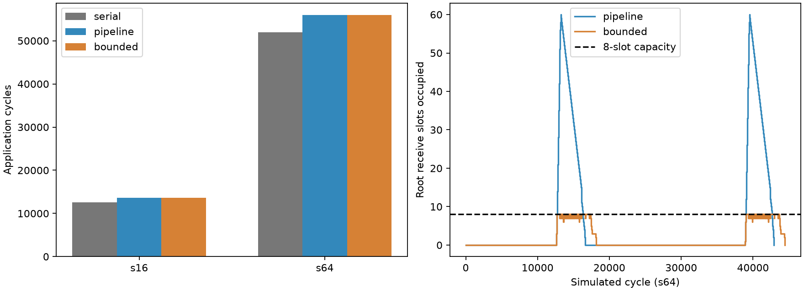

# 存储—网络边界：请求粒度改变执行，有限接收状态改变消息预测

本阶段已在 eex005 完成。网络内部仍使用原 WoW BookSim；新增的是源存储供数、
接收写入和端点 credit 的衔接。**参考目标是明确登记的 streaming DMA 设计假设，
不是已标定的 WoW SRAM/DMA 硬件。**以下误差均相对于这个条件化边界参考。

## 对照合同与结果

使用既有 Baseline、row-major、TP8、direct-root，完整 s16/s64 forward block。
每区域仍为 256 KiB、32 B/cycle 共享读写端口，compute 和网络配置保持一致。
所有模型都从原 SRAM 扣除 20,000 B：2 个 TX 和 8 个 RX 槽，每槽 2000 B。
消费者仍等整个对象写完；rank-local output 与 collective retirement 保持分离。

| 模型 | 存储与网络衔接 |
|---|---|
| serial | 原完整 read → 整消息传输 → 完整 write；不表达 DMA FIFO 占用 |
| pipeline | 每个原始 flit 的有效 payload 读完后允许注入，到达后请求写入；接收 credit 立即返回 |
| bounded | 同样的分片服务；RX 槽在写完后释放，再通过原 credit channel 返回 credit |

serial→pipeline 改变请求粒度、到达时刻和重叠；pipeline→bounded **仅改变接收
credit 返还条件**。不增加 memory ports/bandwidth，不把每个实现分片变成新消息。
原 BookSim 内部 router 仲裁、路由和 VC 保持不变；独立补丁只提供端点钩子并在
初始化时配置 sink-facing credit 容量。[完整合同](../../MEMORY_NETWORK_BOUNDARY_PROTOCOL.md)

| 完整工作 | serial，cycles | pipeline，cycles | bounded，cycles | serial 相对 bounded 的绝对百分比误差 |
|---|---:|---:|---:|---:|
| s16 | 12,534 | 13,583 | 13,583 | 7.7229%（少 1,049 cycles） |
| s64 | 51,966 | 55,944 | 55,944 | 7.1107%（少 3,978 cycles） |

两份 serial 的**全部执行事件**与前轮已验收 BookSim 结果完全一致。
应用时间相同却不能说明 pipeline 可以替代 bounded：

| 工作 | pipeline / bounded RX 峰值，槽 | pipeline 最大消息服务误差 | 最大消息服务百分比误差 |
|---|---:|---:|---:|
| s16 | 18 / 8 | 384 cycles | 28.402% |
| s64 | 60 / 8 | 1,536 cycles | 27.502% |

消息服务从搬运 ready 到完整目标写入完成计量；绝对 commit 时刻差另见
[配对消息](analysis/messages.csv)。百分比与绝对最大值不要求出自同一条消息。
pipeline 满足这两例的 makespan 目标，却违反 8 槽合同及预登记的消息精度目标。
不能将其 RX 超容的执行报告成物理可行。

## 为什么允许流水，完整应用反而更慢？

孤立搬运的重叠确实缩短了完成时间；完整应用还受到共享 memory 请求的排列影响。
serial 在 root 最终结果写完后，先排入 7 个完整 broadcast read；root 本地消费者
的内存请求排在它们后面。分片模式只逐步排入后续 chunk，rank-local 消费者的
memory 请求可以插入这些 chunks 之间，因此其他 rank 的 broadcast 供数更晚结束。

[源端服务窗口](analysis/source_windows.csv)直接记录了这一差别：

| 工作 / attention broadcast | 首次供数请求到最后供数完成 | broadcast 自身 memory service | 其他 operation memory service | 空闲 |
|---|---:|---:|---:|---:|
| s16 serial | 896 | 896 | 0 | 0 |
| s16 bounded | 1,819 | 903 | 912 | 4 |
| s64 serial | 3,584 | 3,584 | 0 | 0 |
| s64 bounded | 7,090 | 3,612 | 3,472 | 6 |

例如 s64 插入的 3,472 cycles 来自 root 的 attention residual、ln2、ffn-up 和
GELU 服务。这是事件回读的共享资源记账，**不是对最终 3,978 cycles 的唯一因果
分解**。当前结论依赖既定 FCFS、逐分片请求和整对象消费政策；不能归结为
“流水本身降低性能”，也不能解释为 wafer 原生内存瓶颈测量。

关键链分类同样发生变化。s16 serial 为 compute/memory/network = 3,080/9,040/414；
bounded 为 3,080/7,134/390，加源端等待 2,979。s64 分别为
15,392/36,064/510 与 15,392/28,204/254，加源端等待 12,094。
`source_queue` 是源端待供数的观测区间，不能改名成纯网络拥塞或纯内存服务。

## 机制、守恒与验证

| 完整机制工作 | serial / pipeline / bounded，cycles | pipeline / bounded RX 峰值 |
|---|---:|---:|
| 单流 | 3,599 / 2,640 / 2,640 | 2 / 2 |
| 慢源（8 B/cycle） | 6,599 / 5,632 / 5,632 | 1 / 1 |
| 三源汇聚、慢写端 | 25,641 / 24,632 / 24,632 | 45 / 8 |
| 共享路径、一端慢写 | 9,667 / 8,700 / 8,700 | 13 / 8 |

每个机制的 transfer 为 32,000 B；后续 SUM 也完整执行。孤立 packet 的供数→接收
间隔为 68 cycles，独立 read/arrival/write 递推得到最后 commit 为 1,139/4,131，
与单流/慢源事件一致。第四例实际经过共同有向链路 6→32；**本例没有观察到慢
接收反馈拖慢另一条流的最终 commit**，不声称已证明跨流放大或网络饱和。

两例应用的原始逻辑网络量仍为 114,688/458,752 B，84/252 flits；memory 有效字节
和计算工作守恒。逐分片向上取整使 memory busy 总量增加 56/224 cycles，单独记录，
不将这部分称为额外 payload。bounded 的总预留峰值（含固定 FIFO）为
83,488/221,728 B，均未超过 262,144 B；所有 TX 峰值不超过 2，RX 不超过 8。

- [151 项语义及原生接口测试](tests.log)通过，包括未供数禁止注入、持有 credit
  后停住/恢复、透明钩子与原 native 时间对齐、容量、完整 collective 生命周期。
- 30 次完整执行经过独立回读，460 项原始产物哈希一致；每个应用模式的 3 次重复
  保持全部事件一致。没有截断工作或把失败运行算入完成数。
- 18 组记录下来的原生端点命令重新执行，逐回复完全一致。它复核接口和驱动，
  **仍使用同一 native binary，不是独立芯片或第二份网络实现的验证**。
- `cycle_limit` 已统一为闭区间截止：恰好在上限完成接受；超过则 incomplete。
  coarse、普通 native 和 boundary 的对应回归通过。

验收记录见 [ACCEPTANCE.json](analysis/ACCEPTANCE.json) 和 [SEMANTICS.json](SEMANTICS.json)。

## 模拟成本与模型选择

相同日志策略、固定两个主机 CPU、轮换顺序、3 次冷进程重复。下表为执行阶段墙钟
中位数，单位秒；不是模拟 cycles，也不包含初始化或事后审计。

| 工作 | serial | pipeline | bounded |
|---|---:|---:|---:|
| s16 | 0.4275 | 0.5344 | 0.5797 |
| s64 | 0.4479 | 0.9032 | 1.1670 |

初始化约 0.36–0.38 s。含所有阶段的 worker 墙钟中位数分别为
s16 1.116/1.216/1.266 s、s64 1.116/1.667/1.867 s。
Python 进程 lifetime RSS 约 82–83 MiB，native 约 9–10 MiB；不是各阶段独立峰值。
[cost.csv](analysis/cost.csv)分开列图构建、初始化、执行、关闭/日志和独立审计。
native CPU 通过退出子进程累计值在 close 时取得，不能误当 close 自身 CPU 成本。
这些是当前两例成本，尚无大规模复杂度或吞吐结论。

对于登记的 streaming DMA 目标，整消息抽象未达到应用精度要求；简单流水能够
恢复本轮 makespan，却不足以预测消息提交和容量可行性。因此保留 **可选** bounded
端点模型，不改默认后端。尚未检验其他 chunk/TX/RX/调度政策；不据此声称有限 FIFO
在所有 workload 必须影响应用时间，不展开 local NoC，也不立即开始 placement 扫描。
下一项若涉及架构排名，应先明确目标端点服务参数依据；当前报告止于边界模型。

## 复现、版本和清理

执行/分析源码为 `b6a89ea`；endpoint binary 构建版本 `bec1051`，其后的更改未修改
native 编译输入。source/binary/environment/input hashes 都在远端 STARTED/COMPLETE
和这里的 acceptance 中。源代码全部属于本仓库；author 文件未原位改动。

远端保留：

- `runs/memory-boundary-004`：接受的全部事件和输入；
- `runs/memory-boundary-tests-005`：同版本测试；
- `runs/memory-boundary-analysis-003`：全量回读、命令重放和图表；
- `build/booksim-boundary`：独立的端点适配 build，原有 online/standalone build 保留。

在 eex005 的 source checkout 使用 `scripts/build_boundary_remote.sh`、
`scripts/test_wow_target_remote.py`，再用新绝对目录运行
`scripts/run_memory_boundary_remote.py OUTPUT --tests TESTDIR/SEMANTICS.json`；
`scripts/analyze_memory_boundary_remote.py RUN OUTPUT` 回读结果。runner 要求当前
源码和测试版本相同、工作树干净；新版本复现应先生成对应测试收据。

本目录只归档小型报告；ANALYZED 中列出的 replay 大文件仍在远端。此前两个候选
共享路径没有实际共享链路，已明确从机制验收中排除；错误未被改写成成功。
删除的中间运行及旧构建对象见 [清理说明](CLEANUP.md)，失败记录和哈希仍可追溯。
