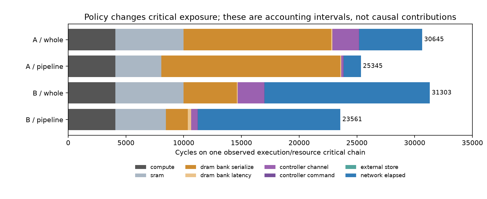
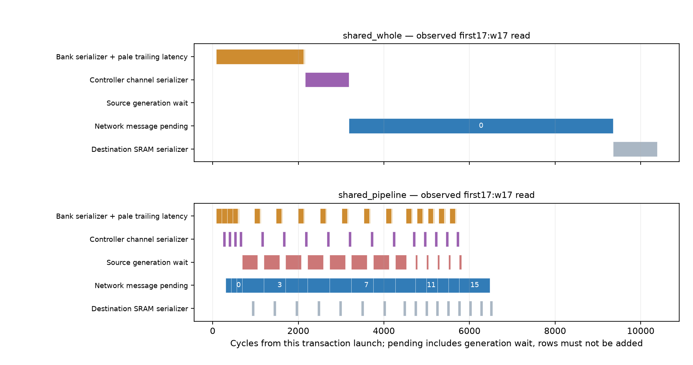

# Frozen memory-periphery traces: critical chain and DMA contract

All 18 accepted applications are reaudited. No simulation or model/policy change.
The available traces support changed supply timing and overlap; they do not
uniquely partition the relative 2,442-cycle benefit into independent causes.

| Layout / shared-interface policy | Compute | Memory | Network elapsed | Makespan |
|---|---:|---:|---:|---:|
| A / shared_whole | 4096 | 21094 | 5455 | 30645 |
| A / shared_pipeline | 4096 | 19746 | 1503 | 25345 |
| B / shared_whole | 4096 | 12902 | 14305 | 31303 |
| B / shared_pipeline | 4096 | 7126 | 12339 | 23561 |

These columns partition one observed execution/resource critical chain. Network
durations remain opaque. Chains change selected operations/fragments; subtraction
is accounting, not an intervention or independent delay attribution.

| Critical bucket | A whole | A pipeline | A difference | B whole | B pipeline | B difference |
|---|---:|---:|---:|---:|---:|---:|
| compute | 4096 | 4096 | 0 | 4096 | 4096 | 0 |
| controller_channel | 2304 | 192 | -2112 | 2304 | 576 | -1728 |
| controller_command | 12 | 8 | -4 | 12 | 8 | -4 |
| dram_bank_latency | 90 | 90 | 0 | 90 | 270 | 180 |
| dram_bank_serialize | 12800 | 15488 | 2688 | 4608 | 1920 | -2688 |
| network/c2c | 699 | 645 | -54 | 649 | 1186 | 537 |
| network/dram_ack | 13 | 13 | 0 | 76 | 76 | 0 |
| network/dram_request | 69 | 47 | -22 | 152 | 154 | 2 |
| network/dram_response | 4151 | 320 | -3831 | 12348 | 10367 | -1981 |
| network/dram_write | 523 | 478 | -45 | 1080 | 556 | -524 |
| sram | 5888 | 3968 | -1920 | 5888 | 4352 | -1536 |

| DRAM read medians | Transaction duration | First payload offset | Release span | Bank/channel busy overlap | Bank/network-pending overlap |
|---|---:|---:|---:|---:|---:|
| A / shared_whole | 6421.0 | 3296.0 | 0.0 | 0.0 | 0.0 |
| A / shared_pipeline | 7241.5 | 867.5 | 6400.0 | 768.0 | 1160.0 |
| B / shared_whole | 8355.0 | 3182.0 | 0.0 | 0.0 | 0.0 |
| B / shared_pipeline | 4616.0 | 302.0 | 3434.0 | 192.0 | 1826.0 |

Earlier first supply and serializer/network overlap are observed, including
external-controller traffic. A read-duration median can increase while
application time falls: peer bank serializers and alternative dependencies
can control the selected chain. Neither sum of medians nor overlap area
is an application-time causal decomposition.

The frozen native trace injection branch uses one-flit packets (head and tail
both true), batching a ready message when the source partial queue is empty.
254 versus 1,445 messages changes release/generation batches, not wire packet
size: both transmit 92,525 single-flit packets. Exact source-order comparisons:

| Layout | Semantic packets | Reversed source-order pairs | Comparable pairs | DRAM-response routes changed |
|---|---:|---:|---:|---:|
| clustered_local | 92525 | 36639490 | 307027420 | 7862 / 73728 |
| remote_balanced | 92525 | 0 | 80313766 | 0 / 73728 |

Source order is compared between actual complete executions with different
ready times, so it does not isolate message batching from supply/overlap.
Critical directed-link windows separately distinguish target, sibling
fragments and other transactions. They demonstrate actual sharing, but
cannot translate peer flits into a unique number of queue-delay cycles.

| Shared pipeline layout | Max per-transaction fragments | Max controller-associated positions | Max descriptor-lifetime proxy | Max receive byte envelope |
|---|---:|---:|---:|---:|
| clustered_local | 4 | 16 | 4 | 16384 |
| remote_balanced | 4 | 4 | 1 | 16384 |

The four-position window is per transaction. Summed positions include queued
source service and remote network/destination work; they are associated
end-to-end demand, not proven controller-resident buffer/descriptor usage.
The descriptor proxy counts command-ready to final destination commit,
one explicitly assumed lifetime. Hardware may use another lifetime or more
than one descriptor per transaction. Existing staging reservations remain
within their declared capacities; they do not enforce either count budget.

Receive envelope adds useful bytes at native ejection+1 and subtracts a
fragment at destination commit. It includes partial fragments and excludes
padding. Partial consumption during serialization is not recorded, and
these native command streams contain no boundary/supply/commit commands.
Endpoint credit return is not tied to SRAM/bank commit. This is not an
RX FIFO capacity certification or a hardware sizing recommendation.

User confirms no target hardware descriptor, outstanding-fragment or RX
budget. All three contract checks remain unmodeled/uncertified; no finite
budget is invented and no recorded run is reclassified against one.

Retain v1 whole and shared pipeline as declared candidates. No hardware-
based principal contract is selected. v1 remains the numerical reference
for its registered D1 experiment only; D1 is unchanged and its applications
remain deferred. A future hardware contract must specify descriptor
lifetime/ownership, controller-wide issue and window limits, and RX storage
with commit/backpressure before selecting a principal target.

Verified 562 raw artifact hashes, 18 applications and their existing chains; 7 new reader regressions pass. Analysis wall 27.903 s; zero new simulations. Large profiles, matched movements and activity tables stay at `/Projects/haoning/wafer_simulator/runs/periphery-attribution-001`.
