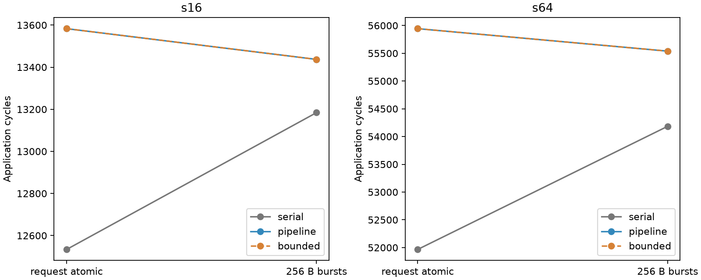

# 内存请求粒度显著影响边界模型差异

本轮完成了同一 Baseline、完整 s16/s64、两套内存服务合同下的三个边界模型对照。
**先前约 7% 的差异不是与内存仲裁合同无关的“流水代价”。**统一采用 256-byte
burst 后，整消息与流水模型的应用时间差从 1,049/3,978 缩至 253/1,355 cycles。
有限 RX 反馈仍未改变这些案例的最终时间，但仍影响消息提交与容量可行性。

这是条件化目标政策及模拟抽象的交互结果，不是 WoW 原生 DMA/SRAM 标定，也不是
对流水成本的唯一因果分解。[事先登记的范围](../../MEMORY_SERVICE_ISOLATION.md)

## 同工作、同预算，分开两条轴

保持既有 TP8、direct-root、row-major、compute rates、共享 memory 32 B/cycle、
BookSim 配置/二进制和 seed。每区域仍为 256 KiB，其中 20,000 B 预留给 2 TX /
8 RX 槽；整个对象写完才发布数据，retirement 和生命周期合同不变。

| 内存合同 | 各客户怎样请求共享端口 |
|---|---|
| request_atomic | 一次提交的请求完整服务后才换客户；与已验收版本相同 |
| burst_256 | 所有普通访存和 DMA 都拆成最多 256 B 的请求；上一 burst 完成后，下一个重新加入 FCFS |

每个逻辑请求只挂一个 burst；计算和网络服务不拆。2000-byte 原生 flit 的有效
payload 全部读完才允许注入；全部写完才释放 RX/credit。256 B 独立于网络宽度，
是预先声明的诊断假设，不是从本轮结果拟合出的参数。当前 service latency 为零，
接口中若声明非零 latency，则每个 burst 单独计入。

每套内存合同内分别比较原有 serial / pipeline / bounded。serial→pipeline 还
改变供数、目的写入时刻及源端消息准入；因此不能把这一列差异称为只打开 overlap。
serial 本身也没有为整消息读取模拟有限 TX 占用，不能为实现“无重叠”而暗中给它
完整消息大小的额外 FIFO。pipeline→bounded 才是单独改变 RX credit 返还条件。

## 应用结果与交互项

单位均为模拟 cycles。每格三次冷进程运行，全部事件一致。

| 完整工作 | 内存合同 | serial | pipeline | bounded | 流水−整消息 |
|---|---|---:|---:|---:|---:|
| s16 | request_atomic | 12,534 | 13,583 | 13,583 | +1,049 |
| s16 | burst_256 | 13,184 | 13,437 | 13,437 | +253 |
| s64 | request_atomic | 51,966 | 55,944 | 55,944 | +3,978 |
| s64 | burst_256 | 54,184 | 55,539 | 55,539 | +1,355 |

改变内存合同使 serial 增加 650/2,218 cycles，pipeline 和 bounded 减少 146/405。
故边界差距的交互项为 −796/−2,623 cycles。这证明该差距依赖服务合同，
**不能把它除以原差距，声称某个百分比已经唯一归因于内存仲裁**。
两套合同的 bounded−pipeline 都为零；本轮仍无有限 RX 改变应用 makespan 的证据。
[逐格数据](analysis/application.csv) / [交互项](analysis/interaction.csv)

## 服务记录解释了什么？

原合同下 serial 把七个完整 broadcast read 排入 root memory，root 本地消费者
排在后面。改成 burst 后，serial 的这些读取也会与本地访存交错。另一方面，
pipeline 的普通访存也不再整对象占住端口，DMA 能在其间获得服务。

attention broadcast 从首个 read 请求到最后供数完成的窗口如下，单位 cycles：

| 工作 / 合同 / 模型 | 窗口长度 | broadcast 自身服务 | 其他操作占用同端口 | 空闲 |
|---|---:|---:|---:|---:|
| s16 / atomic / serial | 896 | 896 | 0 | 0 |
| s16 / atomic / bounded | 1,819 | 903 | 912 | 4 |
| s16 / burst / serial | 1,016 | 896 | 120 | 0 |
| s16 / burst / bounded | 1,434 | 903 | 528 | 3 |
| s64 / atomic / serial | 3,584 | 3,584 | 0 | 0 |
| s64 / atomic / bounded | 7,090 | 3,612 | 3,472 | 6 |
| s64 / burst / serial | 4,088 | 3,584 | 504 | 0 |
| s64 / burst / bounded | 5,679 | 3,612 | 2,064 | 3 |

burst 下 serial 插入的是 root attention-residual 访存；bounded 的窗口里则有
attention-residual 与部分 ln2。各窗口起点也变化，不能把窗口长度差直接相加为
最终应用差。后续 FFN 和关键链也相应移动，详见
[source_windows.csv](analysis/source_windows.csv)。

两套内存合同之间，有效 memory bytes、compute work、网络 bytes/flits 都完全
相同，且同一边界模型的 memory busy 总量也相同：serial 为 33,280/132,352 cycles，
pipeline/bounded 为 33,336/132,576。变化来自服务交错和依赖推进，不是增加
带宽或减少原始工作。后两种模型相对 serial 的 56/224 cycles 尾包取整差仍保留。

关键链上的 compute 部分从 3,080/15,392 变为 3,336/16,416，表示选中的链改变，
不表示总 compute work 或速率改变。`source_queue` 继续只是观测到的待供数区间，
不改名成纯内存或纯网络的独立因果贡献。

## 更小的应用偏差，不等于边界模型已足够

在 burst_256 内，serial 相对 bounded 的应用误差为 s16 **1.8829% / 253 cycles**、
s64 **2.4397% / 1,355 cycles**。预登记标准是同时满足 ≤2% 和 ≤100 cycles，
因此两例都未通过；不能只挑 s16 的百分比宣布通过。

| 工作（burst_256） | pipeline / bounded RX 峰值 | pipeline 最大消息服务误差 | 最大消息百分比误差 |
|---|---:|---:|---:|
| s16 | 16 / 8 槽 | 265 cycles | 41.277% |
| s64 | 63 / 8 槽 | 616 cycles | 13.762% |

消息服务从搬运 ready 到完整目标 commit；百分比与绝对最大值不一定出自同一条
消息。pipeline 的 makespan 虽然相同，仍违反 RX 容量，并超过 ≤5% 且 ≤20 cycles
的消息标准。bounded 全部 TX≤2、RX≤8，没有提前可见或提前释放。
serial 的最大消息绝对误差为 788/3,485 cycles；单条消息误差不能用平均应用误差
代替。[消息配对](analysis/messages.csv)

## 成本与验收

相同 CPU affinity（254、255）、full logging、每格三次冷进程、模型顺序轮换。
执行阶段墙钟中位数如下，单位秒；不把图构建、初始化、序列化或审计计入执行。

| 工作 / 内存合同 | serial | pipeline | bounded |
|---|---:|---:|---:|
| s16 / atomic | 0.429 | 0.529 | 0.587 |
| s16 / burst | 1.645 | 1.742 | 1.775 |
| s64 / atomic | 0.450 | 0.918 | 1.156 |
| s64 / burst | 5.695 | 6.173 | 6.342 |

burst 服务产生更多事件，增加成本；这里没有模拟加速结论。跨内存合同改变的是
目标政策，不能把这两行成本比写成同目标近似算法的加速比。同一合同的三个模型
才是抽象精度—成本比较。全部 wall/CPU/lifetime RSS 和各阶段成本在
[cost.csv](analysis/cost.csv)；native CPU 在进程退出时累计，非分阶段精确分摊。

- eex005 **156 项**指定语义及原生接口测试通过，含手算 FCFS 交错、尾 burst、
  latency、网络/compute 不被拆、提前 supply 的篡改拒绝和生命周期检查。
- **36 次**完整执行，**547 项**产物哈希核对通过；未删依赖、截断工作或扩大 SRAM。
- 原内存合同的全部六种结果与 boundary-004 **完整事件一致**，非仅相同总时间。
- **12 组**端点命令逐回复重放一致；这是同 native binary 的接口验证，非另一份
  网络实现或实际芯片验证。独立审计从声明工作重建 burst 字节序列与 FCFS 服务。

## 本轮决定与证据范围

保留独立的内存服务粒度参数，默认仍为 request_atomic，原执行事件不变。
保留有限 RX 状态用于本合同的消息与容量预测；不能宣称它已改善本轮 makespan。
256 B 不是推荐的硬件参数，也不自动成为默认值。

这轮支持的模型结论是：**内存服务合同必须和网络分包分开声明；相同总带宽与
字节数不足以唯一决定模型之间的应用时间差。**更细粒度本身不等于更接近真实 WoW。
尚未得到纯 overlap 的独立代价，也没有证明需要 8-GPC NoC。后续若研究 placement
收益，应先选定有依据或明确作为假设的目标服务合同；本轮不启动 Rotated 或新扫参。

## 版本与复现

运行与测试源码 `efc35ea`，最终分析源码 `053c1a3`（只增加工作守恒/服务次数回读）。
native binary 未重编，哈希与上一轮完全相同。来源见
[STARTED.json](STARTED.json)、[验收](analysis/ACCEPTANCE.json)、[测试](SEMANTICS.json)。
大事件、输入、环境记录及完整原生命令留在 eex005：

- `runs/memory-service-isolation-001`：接受的 36 次执行；
- `runs/memory-service-tests-002`：同版本测试；
- `runs/memory-service-analysis-002`：最终回读及重放。

在远端 source checkout，以 `PYTHONPATH=src` 和项目 `.venv/bin/python` 依次执行
`scripts/test_wow_target_remote.py TESTDIR`、
`scripts/run_memory_service_remote.py RUNDIR --tests TESTDIR/SEMANTICS.json`、
`scripts/analyze_memory_service_remote.py RUNDIR ANALYSISDIR`，各目录必须为新绝对路径。
runner 要求同版本测试及干净工作树；重复结果不得覆盖已接受目录。
