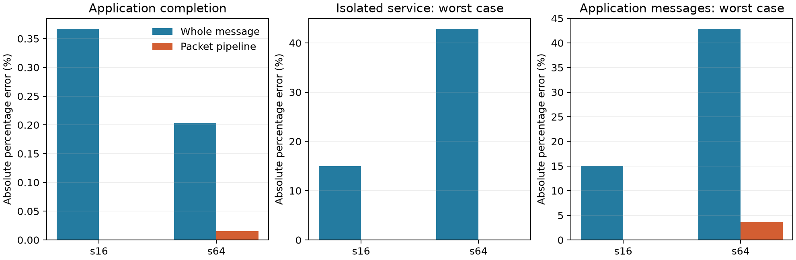

# 跨跳流水修正：保留低成本模型，定位剩余合流误差

2026-10-07，全部运行及验证在eex005完成。**候选packet流水后端消除了已测孤立
传输的服务误差，并把两个完整工作的完成时间误差降至0和0.0154%。**它复用
现有资源日历，不复制BookSim router实现，也没有修改原生二进制。

这是对上一轮同一案例的机制修正与精度—成本验证，不是未知负载上的泛化证明。
默认coarse后端未替换；local compute/SRAM聚合仍没有独立准确性参考。

## 模型改了什么

[登记协议](../../PACKET_PIPELINE_PROTOCOL.md)和[配置](../../../configs/packet_pipeline.json)
保持上一轮两份完整Transformer forward、Baseline、row-major、direct-root、TP8、
32 B/cycle memory、256 KiB容量及计算服务率。没有增加workload、mapping或topology。

粗模型在每个hop完成整条消息后才推进；候选把当前配置的single-flit packet
逐个交给资源日历，使不同packet可同时位于路径不同段。采用作者固定配置的
single-VC/non-speculative allocation启动间隔，并保留原coarse的FCFS输出服务
和确定性最少跳路径。启动间隔来自pinned代码的VC/SW阶段及更新顺序，未从
应用结果拟合。物理channel仍为2000 B/cycle，没有减少或扩充资源预算。

候选没有input-VC仲裁、有限buffer/credit和adaptive routing。支持范围在adapter
明确检查；不支持的synthetic traffic、VC数、packet size或speculation设置拒绝使用。
所有消息仍等待完整接收，后续内存写入及output-ready/retirement规则不变。

实现分层为[参数绑定](../../../src/wafer_sim/adapters/packet_pipeline.py)、
[日历执行](../../../src/wafer_sim/execution/packet_pipeline.py)、
[独立回读](../../../src/wafer_sim/analysis/packet_pipeline.py)；复用原实验计量器。

## 精度改善

单位为被模拟cycles，参考是相同合同的BookSim，不是硅测量：

| 完整工作 | 原生参考 | 整消息coarse | Packet流水 | Coarse应用APE | 流水应用APE |
|---|---:|---:|---:|---:|---:|
| s16 | 12,534 | 12,580 | 12,534 | 0.3670% | 0.0000% |
| s64 | 51,966 | 52,072 | 51,958 | 0.2040% | 0.0154% |

| 服务精度 | s16 coarse / 流水 | s64 coarse / 流水 |
|---|---:|---:|
| 同路径孤立消息最大APE | 15.0000% / 0% | 42.8571% / 0% |
| 完整应用内消息最大APE | 15.0000% / 0% | 42.8571% / 3.5714% |
| 流水在应用内消息MAPE | 0% | 0.3804% |

28条完整孤立传输全部匹配路径且服务时间准确。完整应用s16的28条消息服务
时间全部一致；s64的两次1→0 gather各低估4 cycles，两次5→0 gather各低估
2 cycles，其余消息服务时间一致。前者位于关键链，两次造成−8 cycles：

| 工作/模型 | 关键链compute | memory | network |
|---|---:|---:|---:|
| s16 / BookSim及流水 | 3,080 | 9,040 | 414 |
| s16 / Coarse | 3,080 | 9,040 | 460 |
| s64 / BookSim | 15,392 | 36,064 | 510 |
| s64 / 流水 | 15,392 | 36,064 | 502 |
| s64 / Coarse | 15,392 | 36,064 | 616 |

两次AllReduce的关键网络段为1→0 gather及0→7 broadcast。s64的流水服务为
`108+143`，原生为`112+143`。该分解重建观察到的关键链，不将所有消息误差相加。
候选通过原先登记的应用APE≤2%、同路径孤立服务APE≤5%目标；应用内最大
消息误差也小于5%，但这不是新增或事后调整的验收门槛。



## 剩余误差已定位到合流顺序

对s64最大误差消息，按注入顺序配对packet，逐link比较相对就绪时间。
`attention_sum/phase/2`的路径为`1→23→22→0`。前两段arrival相同，第四个
packet首次在`22→0`出现差异：原生71，流水69 cycles。最后packet为101对97，
最后接收为111对107，因此消息完成为112对108。

这条link的局部顺序如下，时间均相对该collective开始发送，ordinal从0计：

| Link到达cycle | BookSim：源端点/packet | 流水：源端点/packet |
|---:|---|---|
| 65 | 1 / 2 | 1 / 2 |
| 67 | 5 / 2 | 5 / 2 |
| 69 | 6 / 0 | 1 / 3 |
| 71 | 1 / 3 | 5 / 3 |
| 73 | 5 / 3 | 1 / 4 |
| 75 | 6 / 1 | 6 / 0 |

完整gather的这条link有63个packet到达，**两模型的全部到达时间槽相同，
消息获得这些时间槽的次序不同**。因此不能把此处差异说成总带宽变了；
当前FCFS输出聚合没有保留原生合流时的packet服务顺序。具体VC/仲裁内部状态
未记录到足以分解每项因果责任的程度，本轮不进一步声称是某个credit参数导致。

定位按“匹配路径中最大消息APE→首个不同link时间戳”的规则自动生成，见
[RESIDUAL.json](analysis/RESIDUAL.json)与[完整link顺序](analysis/shared_link_order.csv)。
s64另有4个原生flits采用与固定路径不同的路由；这些属于其他消息，不混入上述
同路径例子的误差归因。孤立对齐不代表模型在竞争、改路由或buffer压力下处处等价。

## 仿真成本

同一CPU254/255，三次冷进程加三次图复用，顺序轮换；记录load范围5.84–6.26。
下表为三次的宿主wall中位数，单位秒。完整范围、CPU、RSS及日志量见[成本表](analysis/cost.csv)。

| 工作 / 成本口径 | BookSim | Coarse | 流水 |
|---|---:|---:|---:|
| s16：执行阶段 | 0.4275 | 0.2070 | 0.1791 |
| s64：执行阶段 | 0.4536 | 0.2089 | 0.1812 |
| s16：冷进程扣除已计量审计/replay | 1.0572 | 0.4524 | 0.4976 |
| s64：冷进程扣除已计量审计/replay | 1.1544 | 0.5021 | 0.4891 |
| s16：图复用，初始化+执行+关闭+写记录 | 0.4696 | 0.2163 | 0.1869 |
| s64：图复用，初始化+执行+关闭+写记录 | 0.4968 | 0.2107 | 0.2013 |

候选执行阶段比BookSim快约2.39×/2.50×。相对coarse，冷进程总成本没有一致
优势；不将较少native初始化/IPC成本表述为新的算法复杂度收益，也未做隔离主机
的大规模benchmark。图复用只复用binding及进程缓存，网络状态每次重建。

流水新增672/2016条packet服务记录，单次含验证产物约1.07/2.30 MB，
大于coarse的0.52/0.52 MB，也大于本例BookSim的0.93/1.47 MB。并未以少记事件
取得速度优势。Python生命周期峰值各后端约147/151 MiB（s16/s64）；BookSim
另有约9.3/10.2 MiB native峰值，不能据此宣称大幅节省内存。

## 本阶段决定

保留候选为当前固定配置的可选模型，保留原coarse和BookSim参考，**不自动更换
默认后端**。现有证据支持：加入跨跳packet流水和有来源的启动间隔，能在这些
完整工作上恢复消息服务精度，并保持低于细网络参考的测量成本。

当前剩余误差已经达到登记目标，不继续为了逐事件完全一致扩张模型。若后续
确实需要更严格的关键消息预测，应围绕已定位的共享输出服务顺序作同机对照，
而不是调memory参数、增加GPC或寻找新的placement反转。

这仍是同一分析型小block上的机制修正，未覆盖finite-credit压力、其他VC/packet
配置或新的工作结构，不能自动推广到完整Llama。目标compute/SRAM未标定；没有
native-wafer训练时间、等物理成本、热或reticle内部聚合准确性的新增声明。

## 验收和复现

运行源码`91977c7`，同版本142项测试通过；最终参数拒绝检查源码`a03f0ab`，
144项测试通过（[运行前收据](SEMANTICS.json)、[最终收据](validation/SEMANTICS.json)）。
分析源码`8d92522`独立回读873项产物哈希、36次完整执行和28组孤立传输的两种
网络记录。每后端每工作6次重复的完整事件身份一致；原coarse与BookSim事件
哈希与上轮接受结果完全一致。所有依赖、容量、storage生命周期和packet服务
审计通过。12次native完整运行及28条native孤立消息仍经过standalone时钟核对。

[汇总](analysis/SUMMARY.json)、[应用表](analysis/application.csv)、
[逐消息比较](analysis/pipeline_messages.csv)、[验收manifest](analysis/ACCEPTANCE.json)
及[分析哈希](analysis/ANALYZED.json)保存在主仓库。原事件与`DETAILS.json`只在eex005：

```text
/home/wangziheng/wafer_simulator/runs/packet-pipeline-001
/home/wangziheng/wafer_simulator/runs/packet-pipeline-analysis-002
/home/wangziheng/wafer_simulator/runs/packet-pipeline-tests-001
/home/wangziheng/wafer_simulator/runs/packet-pipeline-tests-003
```

在eex005的source目录用同一环境、干净Git版本和新的绝对输出目录复现：

```bash
export PYTHONPATH=src
PY=/home/wangziheng/wafer_simulator/.venv/bin/python
$PY scripts/test_wow_target_remote.py NEW_TESTS
$PY scripts/run_transfer_granularity_remote.py NEW_RUN --tests NEW_TESTS/SEMANTICS.json --registration configs/packet_pipeline.json
$PY scripts/analyze_transfer_granularity_remote.py NEW_RUN NEW_ANALYSIS
```
