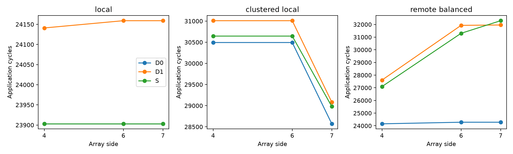
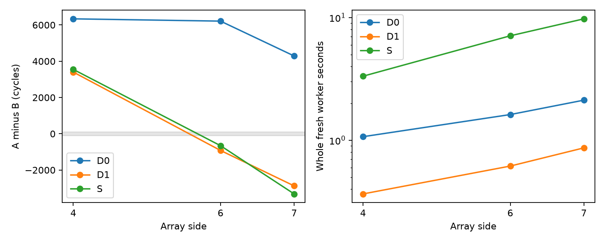

# Registered v1 D1 accuracy–cost judgment

D1 restores the frozen A/B directions and substantially improves application
timing at lower recurring cost. It **does not pass the registered gap budget**:
all nine layout-pair errors exceed 100 cycles. Eight of nine application points
pass 2%; the remaining point is 2.003003%, and remains a failure. This closes
one fixed hypothesis with a partial result, without tuning it or extending it
to the shared-pipeline machine.

## Execution and provenance

Actual new execution on hn072 (`ee4e072`), not a review of old reports:

- Source/test/application/analysis commit: `385426a9c4e0c9e3e4fecf2a79fcdf1ed34452a8`.
- [256 semantic regressions](TESTS.json) pass; the two added provenance/backend
  regressions reject unknown model-source changes, incorrect archived bytes and
  missing/default backend identity.
- 27 cells, 81 full applications, three rotated fresh-process repetitions;
  18 D0/S native command replays. All repeats have identical execution hashes.
- All 27 physical input identities match frozen v1. The 18 D0/S projection
  identities and all nine D0/nine S event identities match accepted D0 evidence.
  Capacity waits are zero; work, messages, bytes, publication and retirement
  pass independent completion checks.
- Existing `runs/d1-components-001`, source `2c4ed6b`, is reused after checking
  1,297 artifact hashes and all 152 records/audits. All 20 singleton cases remain
  exact; the independent law matches all 1,700 D0 calibration conditions. There
  are zero new component executions or calibration runs.
- [Independent readback](VERIFIED.json) checks all 81 applications, the 18
  replays and 1,094 application artifact hashes. `passed` means completion and
  semantics, not that accuracy budgets passed.

The [execution/provenance bridge](../../D1_APPLICATION_EXECUTION.md) enumerates
reviewed validation/API/orchestration changes since the original registration;
it verifies archived bytes, rather than replacing old hashes. Public
`compile_case(..., TransactionPolicy('whole'), interface_organization='bank')`
is the common frontend. D0, D1 and S are explicitly selected and recorded.
No default coarse backend is used. D1 algorithms/audit, execution/storage,
workloads, machine/control parameters, native binary and patches are unchanged.
The original [protocol](../../SHARED_SPATIAL_SERVICE_PROTOCOL.md) and
`configs/shared_spatial_service.json` are unchanged.

Native binary SHA-256:
`d37fc5551d90adb03f2595f9e23ef0199b39be3a572f315ef154bad172d93beb`.
Application manifest SHA-256:
`72ee96e40b592e671309e42f3efc6375664e6005ab2eb8138e05381e2f445cfb`.
Reused component manifest SHA-256:
`44ca1ce850c3e47e536bed18929d76f0dd0feedd0f90bec800f2823c637ccc93`.
[STARTED](STARTED.json), [RUN_COMPLETE](RUN_COMPLETE.json),
[COMPONENTS_VERIFIED](COMPONENTS_VERIFIED.json) and [SUMMARY](SUMMARY.json) retain
source, environment, input, result, calibration and artifact identities.

## Application timing and design decisions

Cycles below are identical across the three repetitions. A is
`clustered_local`; B is `remote_balanced`. Errors are relative to S under the
same v1 bank-interface, whole-object policy.

| Array | Layout | D0 | D1 | S | D1 error |
|---|---|---:|---:|---:|---:|
| 4×4 | Local | 23,903 | 24,141 | 23,903 | +238 |
| 4×4 | A | 30,493 | 31,009 | 30,645 | +364 |
| 4×4 | B | 24,155 | 27,608 | 27,096 | +512 |
| 6×6 | Local | 23,903 | 24,159 | 23,903 | +256 |
| 6×6 | A | 30,493 | 31,009 | 30,645 | +364 |
| 6×6 | B | 24,281 | 31,930 | 31,303 | +627 |
| 7×7 | Local | 23,903 | 24,159 | 23,903 | +256 |
| 7×7 | A | 28,571 | 29,084 | 28,980 | +104 |
| 7×7 | B | 24,281 | 31,960 | 32,298 | −338 |

| Metric | D0 | D1 |
|---|---:|---:|
| Application MAPE | 6.723517% | 1.201247% |
| Worst absolute application error | 24.821970% | 2.003003% |
| Application points within 2% | 6/9 | 8/9 |
| Layout-pair directions matching S | 7/9 | 9/9 |
| Layout-pair errors within 100 cycles | 0/9 | 0/9 |

Signed gap is T(A) − T(B); positive favors B. The fixed 100-cycle
indifference rule is retained, with no false ties in these predictions.

| Array | S gap | D0 gap | D1 gap | D1 gap error | D1 direction | 100-cycle budget |
|---|---:|---:|---:|---:|---|---|
| 4×4 | +3,549 | +6,338 | +3,401 | −148 | B, correct | Fail |
| 6×6 | −658 | +6,212 | −921 | −263 | A, correct | Fail |
| 7×7 | −3,318 | +4,290 | −2,876 | +442 | A, correct | Fail |

All pairs, including Local/A and Local/B, are in [design_gaps.csv](design_gaps.csv).
D1's other six signed errors are +126/−274, +108/−371 and −152/+594 cycles
for A−Local / Local−B at 4/6/7. Rounding +108 to a nominal 100 is not acceptance.

Restricted A/B reference choice regret is 0/658/3,318 cycles for D0 and 0/0/0
for D1. With all Local/A/B candidates, **both select Local alone at every size,
with zero reference regret**. D1 adds no global-selection improvement over D0
here. It also loses D0's exact Local timing, while remaining within 2%.
The workload's private weights and feasible Local layout remain unchanged.



## Component and boundary diagnostics

The same-input component comparison is distinct from independently generated
closed-loop applications. The 18 concurrent/control cases contain 41 matched
message comparisons; their mean absolute duration error is 7.159376%, with a
worst 98.461538%. This is not an application error estimate or fitting dataset.
Disjoint controls agree exactly at 2,122 cycles; reverse-direction native
messages take 2,123 versus D1's 2,122. Complete results are in
[components.csv](components.csv).

| Same-input component | D1 message durations | S message durations |
|---|---|---|
| Three shared, ready offset 0 | 6,218 / 6,218 / 6,218 | 6,176 / 6,175 / 4,148 |
| Three shared, offset 509 | 4,946 / 5,455 / 5,201 | 5,730 / 5,730 / 4,168 |
| Three shared, offset 3,000 | 2,122 / 2,122 / 2,122 | 2,122 / 2,122 / 2,122 |
| Two common-source, offset 0 | 4,128 / 4,149 | 2,080 / 4,149 |

These observations constrain the end-to-end fairness assumption; they do not
measure native steady-state arbitration shares or uniquely identify its cause.
Exact singleton agreement does not establish concurrent-service equivalence.

There are 69 semantically matched S-critical network messages across the nine
application inputs. Their duration-error MAPE is 7.807703% for D0 and 6.224255%
for D1; worst absolute duration errors are 5,258 and 1,162 cycles. In 6×6 B,
`first17/phase/4` takes D0=2,122, D1=6,218 and S=6,177 cycles. D1's service
error is +41, but its ready time is 3,186 versus S's 3,182. The
[service table](critical_service_errors.csv) keeps ready offsets separate:
different closed-loop backgrounds prevent treating these as controlled
same-input service interventions.

An earlier divergence is already visible in 6×6 B's 16-byte
`first1/phase/0` read request: both are ready at 0 on the same observed router
path `[2,14,26,38,39]`, but D1 completes at 80 and S at 76. This is the first
mismatching matched message ready/finish boundary in that case (raw rep-0
records); it precedes the long-response difference. Route mismatch is not
needed for that particular discrepancy. It does not allocate later error
to one sharing/transient mechanism. No native timing was fed into prediction.

Post-prediction route matching finds every native flit on D1's selected path
for 98/114 to 338/345 messages, depending on the input. Some messages use
different native paths; adaptive S routing and deterministic D1 routing are
part of the hypothesis bundle. [route_summary.csv](route_summary.csv) retains
all nine counts. Full per-message paths remain server-only. These diagnostics
do not prove that matching paths imply matching arrival/service, or that route
differences explain the final gaps.

## Recurring and one-time costs

Measurements use three fresh workers per cell on the same host in rotated
order. Complete-worker wall includes imports, public graph/binding preparation,
network setup, execution, serialization/logging and independent audit. Numbers
below are ranges of **per-cell medians**, not fastest samples.

| Cost | D0 | D1 | S |
|---|---:|---:|---:|
| Complete worker wall, seconds | 1.067–2.126 | 0.365–1.167 | 2.930–16.122 |
| Execution wall, seconds | 0.180–0.868 | 0.046–0.653 | 1.080–9.081 |
| Worker independent audit, seconds | 0.026–0.088 | 0.020–0.100 | 0.532–2.178 |
| Python full-worker peak RSS, KiB | 98,952–139,444 | 62,324 | 196,300–579,788 |
| Native child peak RSS, KiB | 17,860–80,232 | 0 | 99,056–433,048 |
| Serialized execution bytes | 3,492,403–11,819,326 | 504,256–2,807,297 | 22,637,676–131,769,623 |
| Native flit records per execution | 4,353–12,801 | 0 | 41,265–125,844 |
| Fluid epochs per execution | 0 | 38–143 | 0 |

Matched-cell complete-worker S/D1 ratios are **8.028–13.814×**, median
11.533× (geometric mean 10.831×); D0/D1 ratios are 1.818–2.930×. Execution-only
S/D1 ratios are 11.071–27.170× and are a separate quantity. Parent and native
RSS maxima occur independently and are not added into a simultaneous total.
Epochs are intervals with per-flow/resource records, not equivalent flit events.
Reduced detailed work/output is part of the abstraction's benefit.

Execution Python CPU ranges are 0.046–0.653 seconds for D1, 0.069–0.280 for D0,
0.348–1.965 for S. Native total child CPU ranges are 0, 0.133–0.677 and
0.916–8.553 respectively. These are not complete-worker CPU measurements.
[costs.csv](costs.csv) contains phase medians/ranges and all nine cell costs;
[SUMMARY](SUMMARY.json) retains the verified aggregates.

| Array / layout | D0 whole seconds | D1 whole seconds | S whole seconds | S/D1 |
|---|---:|---:|---:|---:|
| 4 / Local | 1.067493 | 0.364912 | 2.929645 | 8.028× |
| 4 / A | 1.069736 | 0.365035 | 3.326128 | 9.112× |
| 4 / B | 1.068477 | 0.364978 | 4.280618 | 11.728× |
| 6 / Local | 1.620699 | 0.615541 | 6.236996 | 10.133× |
| 6 / A | 1.570108 | 0.615593 | 7.099474 | 11.533× |
| 6 / B | 1.618631 | 0.866237 | 10.510865 | 12.134× |
| 7 / Local | 2.125711 | 0.866220 | 8.843801 | 10.210× |
| 7 / A | 2.076453 | 0.816181 | 9.760062 | 11.958× |
| 7 / B | 2.121408 | 1.167040 | 16.121864 | 13.814× |

Original D0 calibration costs **628.030730 seconds**, 1,694,921 table bytes;
original D1 component validation costs **24.774512 seconds**. D1 reuses the
validated law, so these prior costs do not disappear from first-use accounting.
The new campaign is 328.775666 seconds, including 273.207196 seconds of all
81 D0/D1/S fresh workers, 47.674414 seconds of replay, 4.305456 seconds of
component evidence revalidation and 1.616414 seconds of source/input gates;
the remainder is orchestration/manifest work. This is campaign execution cost,
not all research effort or a standalone-D1 speedup including calibration.
Per-worker audit costs are included above; later full archival readback is
separate from the worker benchmark and has no timing-speedup claim.



In the left panel, shading marks ±100-cycle **choice indifference around zero**;
it is not a ±100 error band around S. The right panel takes the median over
layouts of complete-worker per-cell medians, using a logarithmic vertical axis.

## Method judgment and retained limits

Shared state is useful in this fixed candidate: D1's combined approximation
recovers the restricted directions with substantially smaller errors and
recurring cost. Immediate whole-path occupancy, max-min flow fairness,
deterministic routes and post-serialization propagation are **not individually
validated as sufficient**, and the strict magnitude target is still unmet.
D0 retains native C2C/I/O while D1 models all traffic analytically, so D1−D0 is
not solely a change in DRAM competition.

The [necessary-information table](../../NECESSARY_INFORMATION.md) organizes
observed results and constructed distinguishing examples. A next method can
test preserving local arrival/service/completion/feedback boundaries while
compressing repeated advancement. That backend is not implemented here; these
results do not establish that queues, credit or any specific additional state
are necessary. No new parameter scan, workload, memory protocol or pipeline
accuracy comparison belongs to this completed registration.

Whole and ideal pipeline remain separate machine contracts. The repeated
4×4/6×6/7×7 GEMMs are regressions, not holdouts. This result does not establish
hardware accuracy, cross-workload generalization, equal physical cost or
novelty relative to other network simulators.

## Reproduction and evidence location

Use source `385426a` in a clean hn072 checkout, its own passing test receipt,
the original calibration and `runs/d1-components-001`. See
[D1_APPLICATION_EXECUTION](../../D1_APPLICATION_EXECUTION.md). On the server:

```sh
cd /Projects/haoning/wafer_simulator/source
env PYTHONPATH=src ../.venv/bin/python -m wafer_sim.experiments.shared_spatial_service \
  --tests /Projects/haoning/wafer_simulator/runs/d1-application-tests-NEW/SEMANTICS.json \
  --component-root /Projects/haoning/wafer_simulator/runs/d1-components-001 \
  --output /Projects/haoning/wafer_simulator/runs/d1-applications-NEW
env PYTHONPATH=src ../.venv/bin/python -m wafer_sim.analysis.shared_spatial_study \
  /Projects/haoning/wafer_simulator/runs/d1-applications-NEW \
  /Projects/haoning/wafer_simulator/runs/d1-analysis-NEW
```

This campaign's roots are `runs/d1-application-tests-001`,
`runs/d1-applications-001` and `runs/d1-analysis-001`. Large raw events, public
case inputs, native streams and detailed paths stay there. Published compact
artifacts are byte copies; the completion/readback manifests also list
server-only files. Copies are checked against their server bytes separately
from those original manifests. No old accepted evidence is overwritten.
