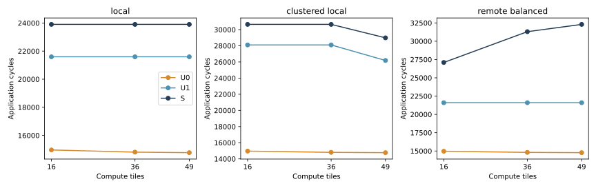
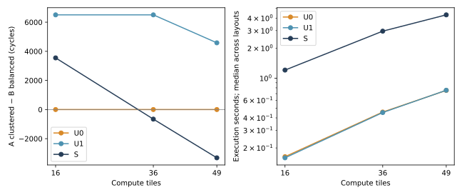

# Locality–controller balance changes the layout decision with wafer extent

Accepted on hn072 (`ee4e072`). Run source `2d91e6b`; independent readback
`cb12211`. **27 configurations, 81 complete executions, 27 native command
replays, 196 semantic/interface tests and 1,245 raw artifact hashes passed.**
All three repetitions reproduce identical full execution hashes. The two
4×4 local/remote S cases reproduce the pre-migration accepted event hashes.
The execution kernel, physical transaction rules, U0/U1/S projections and
native BookSim binary remain frozen. No new timing mechanism was introduced.

The result goes beyond a near/remote false tie: **U1 selects the wrong member
of a predefined locality-versus-load-balance pair at 6×6 and 7×7.** It omits
the spatial network service that outweighs the clustered layout's bank
competition. This is reference-relative evidence under a declared machine;
it does not establish hardware accuracy or the necessity of every BookSim state.

## Fixed controls and physical scope

The [pre-registered protocol](../../SPATIAL_SCALING_PROTOCOL.md) fixes one worker
per compute tile, two GEMMs and 1,048,576 MACs per worker. Tile resources, shapes,
compute rates, bank/controller service, SRAM/staging capacity, transaction
policy and seed remain unchanged. There are 32 / 72 / 98 operations and
16 / 36 / 49 workers. One initial object remains at the fixed edge I/O gateway;
other initial activations are SRAM resident. Thus mathematical work and object
sizes weak-scale, while external-I/O demand is a declared fixed exception.

All three arrays pass corner containment in the ideal 300 mm circle, HB
alignment, stitching signal and router-port budgets. These are **geometry and
connectivity checks**: no wafer edge exclusion, routing/clock closure, power,
yield or fabrication qualification is established.

| Array | Compute MAC/cycle | Aggregate bank B/cycle | HB B/cycle per direction | Horizontal cut B/cycle per direction |
|---|---:|---:|---:|---:|
| 4×4 | 4,096 | 1,024 | 1,024 | 256 |
| 6×6 | 9,216 | 2,304 | 2,304 | 384 |
| 7×7 | 12,544 | 3,136 | 3,136 | 448 |

The cut is the boundary between two adjacent central rows, not a claimed
saturation result. Bandwidths are installed nominal budgets; controller
channels and dependencies still constrain their use.

Three layouts were defined before any application run:

- Local: a bank object resides at its consuming compute tile.
- A, `clustered_local`: each 2×2 group uses its upper-left controller,
  at most two mesh links away; at most four workers share it.
- B, `remote_balanced`: shift controller assignment by half the array height;
  one worker per controller, with longer C2C paths.

Mean DRAM C2C distances are A: 1 / 1 / 0.857 links, B: 2 / 3 / 3.429 links.
The odd 7×7 edge groups are smaller by the registered rule. Do not interpret
7×7 as a pure continuous size perturbation with identical cluster structure.
The reversal already occurs between the two even arrays, 4×4 and 6×6.

Even reserving every operation simultaneously fits the original capacities.
Largest controller staging demand is 589,824 bytes versus the unchanged
1,048,576-byte budget. **Every execution has zero capacity-admission wait.**
The former concentrated-controller staging bottleneck is excluded in this study.

## Application and design-selection results

All times below are simulated cycles, not host seconds. Within every cell,
U0/U1/S evaluate the same physical machine, work and data layout.

| Array | Layout | U0 | U1 | S |
|---|---|---:|---:|---:|
| 4×4 | Local | 14,963 | 21,596 | 23,903 |
| 4×4 | A: clustered local | 14,963 | 28,102 | 30,645 |
| 4×4 | B: remote balanced | 14,963 | 21,596 | 27,096 |
| 6×6 | Local | 14,808 | 21,596 | 23,903 |
| 6×6 | A: clustered local | 14,808 | 28,102 | 30,645 |
| 6×6 | B: remote balanced | 14,808 | 21,596 | 31,303 |
| 7×7 | Local | 14,772 | 21,596 | 23,903 |
| 7×7 | A: clustered local | 14,772 | 26,180 | 28,980 |
| 7×7 | B: remote balanced | 14,772 | 21,596 | 32,298 |

For the primary A–B decision, positive means B finishes sooner:

| Array | S: A−B | U1: A−B | U1 gap error | U1 selection | U0 gap error |
|---|---:|---:|---:|---|---:|
| 4×4 | +3,549 | +6,506 | +2,957 | Correct direction | −3,549 |
| 6×6 | −658 | +6,506 | +7,164 | Wrong direction | +658 |
| 7×7 | −3,318 | +4,584 | +7,902 | Wrong direction | +3,318 |

All three U1 gap errors exceed the registered 100-cycle budget. U0 predicts
a tie at every scale and also fails that budget. The 6×6 reference margin is
658 cycles; it is outside the registered 100-cycle tie interval, but remains
conditional on the uncalibrated machine policies.

Across all nine machine/layout points, application MAPE is **46.363% for U0**
and **15.517% for U1**, with worst errors 54.263% and 33.135%. S is the
declared-mechanism reference, not an independently measured wafer truth.

Local is still S's best layout at every size. The A–B reversal does **not** mean
clustering is the globally best placement. When all three layouts are allowed,
U1 ties Local and B; its candidate set includes reference penalties of up to
3,193 / 7,400 / 8,395 cycles. A tie is not resolved by an arbitrary label order.
See [all pair decisions](analysis/design_gaps.csv) and
[candidate-set regret](analysis/SUMMARY.json).

## What changes on the observed critical chain?

| S layout | Array | Compute | Memory | Network | Capacity |
|---|---|---:|---:|---:|---:|
| Local | All | 4,096 | 14,014 | 5,793 | 0 |
| A | 4×4 / 6×6 | 4,096 | 21,094 | 5,455 | 0 |
| A | 7×7 | 4,096 | 19,046 | 5,838 | 0 |
| B | 4×4 | 4,096 | 12,902 | 10,098 | 0 |
| B | 6×6 | 4,096 | 12,902 | 14,305 | 0 |
| B | 7×7 | 4,096 | 12,902 | 15,300 | 0 |

For A, the selected 4×4/6×6 chain includes 12,890 cycles of bank service;
B includes 4,698. A has actual bank queues (maximum per-bank accumulated
wait 12,200 cycles), while B's bank queues are zero. This is bank competition
within the shared controller organization, not staging exhaustion or a large
controller-command queue. These overlapping queue totals are not added to
application time. HB volume is concentrated at A's controllers.

For B, the 4×4→6×6 increase is exactly **4,207 observed critical-network cycles**;
the selected compute/memory totals remain unchanged. Two critical 65,536-byte
responses grow from 4,129 / 4,142 to 6,177 / 6,171 cycles. Their injection spans
grow from 3,760 / 3,842 to 5,762 / 5,758 cycles, although first-flit injection
wait stays zero. Each route now has four instead of three physical links.
The increase is therefore not just a fixed extra-hop startup latency: the
duration of supplying the whole message to the native network also changes.
These paired chain intervals are observed accounting, not independent causal
effects of routing, VC/credit or competition. Full routes are retained in
[critical_routes.json](analysis/critical_routes.json).

Actual C2C flit traversals for B increase **81,504 → 267,076 → 412,152**;
per-worker traffic traverses more of the fabric. A gives 44,592 / 100,972 /
121,470; Local gives 7,680 / 17,920 / 24,576. HB traversals grow with work,
36,912 / 83,052 / 113,043, for every layout. Nominal link widths and bank
work per tile have not changed.

Network time becomes the largest selected service category for B at 6×6,
and U1 misses the resulting A–B crossover. This supports **growth of critical
spatial-network exposure**, not a universal compute→memory→HB→C2C capacity
bottleneck sequence. B's highest whole-run directed C2C busy fractions are
17.97% / 22.93% / 22.22%; largest 256-cycle activity is 0.5 flit/cycle. Its
first-flit injection waits are zero. A has up to 36-cycle first-flit waits
at 4×4/6×6, but that does not make it the slower design at every scale.
Neither nominal cut saturation nor HB saturation is established.

The 7×7 A decrease includes 2,048 fewer bank-service cycles on the selected
chain and 383 more network cycles. Its smaller edge clusters and a different
critical chain are part of the fixed layout rule; it is not evidence that
growing a wafer generally makes each task faster.

## Accuracy–cost envelope on the new server

Three fresh processes per cell; same binary, affinity to CPUs 18/19, seed,
logging policy and model-order rotation. Entries are ranges of cell medians
across the three layouts. Host load is recorded, not claimed exclusive.

| Array | U0 execution s | U1 execution s | S execution s | S largest Python / native peak MiB | S flits | S max link events |
|---|---:|---:|---:|---:|---:|---:|
| 4×4 | 0.163–0.164 | 0.158–0.162 | 0.941–1.500 | 144.2 / 132.8 | 41,265 | 118,673 |
| 6×6 | 0.457–0.458 | 0.442–0.453 | 2.635–4.634 | 252.5 / 329.7 | 92,525 | 350,385 |
| 7×7 | 0.752–0.758 | 0.735–0.761 | 4.042–7.510 | 314.7 / 422.9 | 125,844 | 525,452 |

Python and native peaks are separate processes, sampled at execution end;
their maxima are not a synchronized total and exclude later audit peaks.
U0/U1 still use native C2C/I/O: 4,353 / 9,473 / 12,801 flits. They omit native
DRAM packet events rather than doing identical detailed work faster. All models
retain 324 / 724 / 984 local service events. S's largest measured execution
remains below eight seconds on this host, so reference cost does not block
this matrix; three scales do not prove asymptotic scalability.

For 7×7 B, S's median preparation/configuration/initialization costs are
0.043 / 0.322 / 0.021 s, execution 7.510 s, close/network serialization 1.558 s,
result serialization 0.861 s and independent audit 1.869 s. Native CPU over
the measured client lifetime is 6.824 s; execution Python CPU is 1.667 s.
Replay is separately metered. See [all phase costs](analysis/costs.csv).
Execution includes IPC and logging; it is not total driver time or a new
simulation-speed algorithm result. No eex005 time is mixed into this comparison.

## Model decision and scope

For these fixed A/B layouts, controller-aware uniform communication is
insufficient for selection at 6×6/7×7. Preserve spatial transfer service as well
as bank/controller sharing. U0 is unsuitable for the registered layout-gap
judgment at all three sizes; U1 captures bank load but can prefer a spatially
costly balanced design. This is stronger evidence than a near/remote false tie.

It still does not establish that full flit simulation is the minimum necessary
method. U1 replaces DRAM transfers with an independent nominal-bandwidth cost;
S−U1 jointly includes path, injection, sharing, routing and credit behavior.
A cheaper path-aware model may recover the decision. No new such model is
introduced here, and no unique omission is selected solely from this difference.
The frozen models have now answered the coverage question; another generic
scale sweep or a new FIFO/DRAM/thermal mechanism is not required to close it.

## Evidence and reproduction

- [STARTED.json](STARTED.json): source, environment, tests, binary and registration.
- [COMPLETE.json](COMPLETE.json): 81 full runs, 27 replays, raw hashes.
- [SEMANTICS.json](SEMANTICS.json) and [tests.log](tests.log): 196 tests on hn072.
- [VERIFIED.json](analysis/VERIFIED.json): all raw hashes and all 81 full
  execution audits recomputed; input, capacity, dependency, byte/path, lifetime,
  critical-chain and repeated-event checks passed.
- [PREFLIGHT.json](analysis/PREFLIGHT.json): geometry, every capacity upper bound,
  fixed resources, loads and compiled-input hashes.
- [application](analysis/application.csv), [resources](analysis/resources.csv),
  [links](analysis/physical_links.csv), [messages](analysis/messages.csv).

Raw events remain at `/Projects/haoning/wafer_simulator/runs/spatial-scaling-001`;
readback is `runs/spatial-scaling-analysis-002`. Analysis attempt 001 stopped
on a summary-field name collision; it has no acceptance marker and changed no
simulation artifacts. The corrected analysis was rerun over all saved events.
The compact tables/figures here are downloaded copies; raw manifests do not
mean multi-gigabyte event files were added to Git. [README](../../../README.md)
contains the current remote reproduction command. Historical eex005 evidence
is retained as described in the [migration receipt](../server-migration-001/REVIEW.md).
