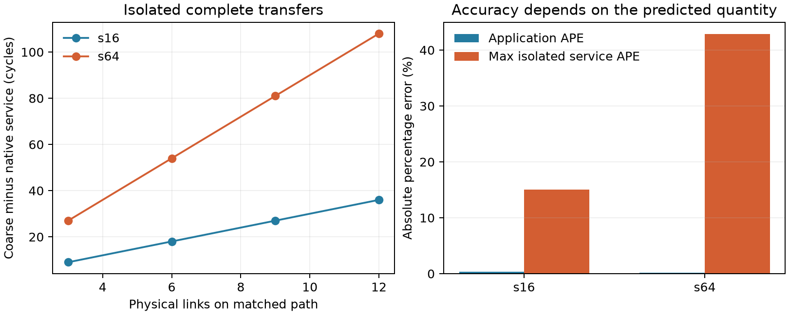

# WoW 模拟抽象：应用时间接近，不等于消息服务准确

2026-10-07，在 eex005 完成并独立回读。**现有粗模型在这两份完整工作上满足
事先登记的应用时间目标，但不满足逐消息服务目标。**已定位到整消息逐跳服务
与原生分片流水之间的差异；本轮没有修改任何后端或资源参数。

这不是 reticle 内部 compute/SRAM 聚合的准确性验证：两后端共用这些分析型
资源，目前仍没有独立的 GPC/SRAM 参考。也不据此增加 local NoC 或边界 FIFO。

## 1. 同机、同工作、不同网络抽象

[实验卡](../../TRANSFER_GRANULARITY_PROTOCOL.md)和[固定配置](../../../configs/transfer_granularity.json)
在运行前登记。固定 Baseline、row-major、direct-root、TP8、batch1、hidden64、
eight heads、FFN128、seed1；memory 为32 B/cycle、256 KiB/region；compute 保留
原分析型服务率。网络仍是1 GHz、2000 B/flit、原作者路由和有限 VC/credit。

只采用 sequence16、64 两种完整 forward。各114个操作、28条消息，逻辑网络
字节分别为114,688、458,752；native 分别完成84、252个 flits。最大区域占用
分别为62,464、197,632 B，均小于262,144 B，没有扩容、截断或删依赖。

对每份工作，两后端各做3次独立进程运行，再在一个进程内复用图做3次运行，
合计24次完整执行。另从真实 binding 提取各14组唯一端点/大小，进行28条完整
孤立传输的组件表征；每条使用空网络并排空 credit。孤立调用不冒充应用结果。

所有28条孤立传输的全部 flit 路径与 coarse 路径一致。完整应用 s16 无路径
差异；s64 有4个 flits 选择不同路径，均不在下面选定关键链的四条消息上。
因此孤立服务可以比较同路径误差，完整应用仍保留路由/竞争差异的明确边界。

## 2. 预测量不同，精度结论不同

| 完整工作 | BookSim cycles | Coarse cycles | 差值 | 应用 APE | 同路径孤立服务最大 APE |
|---|---:|---:|---:|---:|---:|
| s16 | 12,534 | 12,580 | +46 | 0.3670% | 15.0000% |
| s64 | 51,966 | 52,072 | +106 | 0.2040% | 42.8571% |

预先登记的目标是应用 APE≤2%、每条同路径孤立服务 APE≤5%。前者两例通过，
后者两例均不通过。阈值是本轮工程筛查目标，不是通用精度标准。只研究一个
placement，不据此认可亚百分比设计收益预测或 topology 排序精度；已有
[12例设计差距分析](../model-fidelity-saved-001/REVIEW.md)继续独立保留。



### 错在什么地方

选择同一路径的0→4传输，跨12条物理链路；不存在其他消息竞争：

| 量 | 4096 B / 3 flits | 16384 B / 9 flits |
|---|---:|---:|
| Coarse 固定 latency 总和 | 234 | 234 |
| Coarse 各跳串行服务总和 | 42 | 126 |
| Coarse 完成时间 | 276 | 360 |
| Native 首 flit 完成边界 | 236 | 236 |
| Native 首尾接收跨度 | 4 | 16 |
| Native 完成时间 | 240 | 252 |

Coarse 对注入、12条链路、接收共14项服务分别处理整条消息，故串行项为
`14×ceil(bytes/2000)`。Native 时序显示首 flit 时延不变，之后的 flits 在这些
孤立案例中以2 cycles 的接收间隔推进，尾部跨度不会在每一跳重新累加。
更细的 link-arrival 记录也显示，s64 的16-cycle 首尾跨度沿12条链路保持，
不是逐跳增加16 cycles。

因此误差并非缺少平均物理距离，也不需要用“网络饱和”解释。整消息逐跳服务
不符合此参考中的分片流水。另一方面，测得接收间隔是2 cycles，不能直接拿
名义1 flit/cycle套一个理想流水公式替换。具体 router/VC 服务节奏仍需保留。
这里的观测用于定位机制，未拟合一个新延迟函数，也没有实施新快速后端。

### 为什么应用误差仍小

独立重建的关键链服务分解如下；所有项相加等于完整完成时间：

| 工作/后端 | Compute | Memory | Network |
|---|---:|---:|---:|
| s16 / BookSim | 3,080 | 9,040 | 414 |
| s16 / Coarse | 3,080 | 9,040 | 460 |
| s64 / BookSim | 15,392 | 36,064 | 510 |
| s64 / Coarse | 15,392 | 36,064 | 616 |

两次 AllReduce 的关键网络段都是1→0 gather和0→7 broadcast。s16每次为
`76+131`（native）对`81+149`（coarse），两次差46 cycles；s64每次为
`112+143`对`111+197`，两次差106 cycles。其余关键链本地服务总量相同。
这是已发生关键链的记账闭合，不是将全部消息误差求和，也不是独立干预的因果分解。

尤其 s64 的1→0 gather：孤立 native 只需84 cycles，应用内需112 cycles；
coarse 在应用内为111 cycles。孤立时粗模型高估27 cycles，应用内却略低估1 cycle。
这个例子说明流水误差与动态干扰可以部分抵消。首 flit 注入等待为0也不代表
路径中没有竞争，不能把112−84都归因到某个尚未定位的具体端口。

当前模型合同下 memory 服务占关键链的大部分。增大 sequence 同时增加本地
工作，不能将 s16→s64 的应用变化解释为只增加了网络消息长度。两后端在每一个
条件内才是同工作对照。这里没有网络饱和或真实 wafer memory-bound 的测量证据。

## 3. 成本：单独计执行，不把审计当 BookSim

单位为宿主秒，均为3次的中位数；范围及全部分阶段数值见[成本表](analysis/cost.csv)。
所有后端测量进程固定 CPU254/255，依次运行并交替顺序，服务器1分钟 load
记录范围4.57–5.68。没有清空 OS page cache，不是严格独占机器基准。

| 工作 | 执行阶段 Native / Coarse | Native / Coarse 比 | 冷进程 wall，扣除已计量验证 | 图复用：初始化+执行+关闭+写记录 |
|---|---:|---:|---:|---:|
| s16 | 0.4257 / 0.2068 | 2.06× | 1.1065 / 0.5021 | 0.4712 / 0.2102 |
| s64 | 0.4565 / 0.2097 | 2.18× | 1.1493 / 0.5016 | 0.5059 / 0.2109 |

构图/binding约0.017 s，输入记录约0.003 s。共同几何导出0.781 s，在父进程
单独执行、不限为双核，也不纳入后端成本比。冷进程数包含 import、启动、退出
及计量记录开销，扣除明确计量的审计/replay；不是单纯网络内核成本。
图复用包含Python模块缓存效应，native进程及网络状态每次重新初始化。

Native standalone回放验证分别另花约0.499/1.405 s；独立完成审计约0.010–0.013 s，
这些均未混入执行阶段。原生日志、IPC与flit记录开销仍包含在实际执行成本中。
本轮测量已有实现的成本差，不声称新模拟算法加速。

冷进程后端总CPU（初始化、执行、关闭、记录写入，Python加退出后的native）
约0.906/0.211 s（s16）、0.942/0.213 s（s64）。其中native子进程总CPU约
0.231、0.256 s，未虚构其各阶段CPU分解。进程内复用后三次的相同总CPU口径
约0.480/0.209、0.512/0.210 s。

Python执行结束前的生命周期峰值两后端分别约148/151 MiB（s16/s64），
native另约9.3/10.2 MiB。峰值含imports/构图，图复用为累计高水位；两个进程
峰值之和只是上界。本例不能证明粗后端大幅节省内存。每次完整含验证的产物
约0.93/0.52 MB（s16）、1.47/0.52 MB（s64），两后端原记录策略均保留。

## 4. 研究决定

- 对这两份工作、当前执行合同和2%的**完成时间**目标，保留现有粗后端；
  没有证据要求所有运行都换成细网络。
- 对同路径**消息服务**的5%目标，现有整消息逐跳抽象不合格。若下一项设计
  判断依赖这类时间，最小待检验修正是跨跳流水及相应服务间隔；不同时改
  compute、SRAM、mapping或路由，也不能保证一个无竞争公式能恢复竞争结果。
- 本轮没有证明reticle聚合不够，更没有证明必须显式模拟8 GPC。
  验证那一层仍需同资源预算下的独立本地服务参考；不能用共享本地假设的
  两个网络后端互相背书。
- 不扩充算法排行榜、mapping sweep、thermal或Chakra恢复。精度—成本结论
  先限定到实际覆盖的预测量与工作条件，而不将一项机制发现包装为完整新方法。

## 5. 验收与复现

运行源码`e3eb611`，136项语义/原生接口测试通过（[收据](SEMANTICS.json)、[日志](tests.log)）。
分析源码`ebd767c`：785个运行产物哈希匹配；24次完整执行逐一通过独立服务、
依赖、容量与生命周期审计；每后端6次重复的完整事件哈希一致；两后端输入
身份相同。12次native完整应用与28条孤立传输均通过standalone时间戳检查。

[应用表](analysis/application.csv)、[孤立服务表](analysis/isolated.csv)、
[汇总](analysis/SUMMARY.json)、[验收与原产物哈希](analysis/ACCEPTANCE.json)、
[分析产物哈希](analysis/ANALYZED.json)随仓库提供。
大体量事件、原生日志和`DETAILS.json`只保留在eex005；哈希登记不代表已下载。

```text
/home/wangziheng/wafer_simulator/runs/transfer-granularity-001
/home/wangziheng/wafer_simulator/runs/transfer-granularity-tests-001
/home/wangziheng/wafer_simulator/runs/transfer-granularity-analysis-002
```

在eex005的`/home/wangziheng/wafer_simulator/source`下，以已固定的环境运行。
路径必须新建，以下用`NEW_*`表示新的绝对目录：

```bash
export PYTHONPATH=src
PY=/home/wangziheng/wafer_simulator/.venv/bin/python
$PY scripts/test_wow_target_remote.py NEW_TESTS
$PY scripts/run_transfer_granularity_remote.py NEW_RUN --tests NEW_TESTS/SEMANTICS.json
$PY scripts/analyze_transfer_granularity_remote.py NEW_RUN NEW_ANALYSIS
```

原生参考是pinned BookSim模型而非硅测量。运行的source、input、binary、环境
身份保存在原目录`STARTED.json`及manifest。本地compute/SRAM未标定，
不作原生wafer应用时间、等成本架构或thermal的声明。
