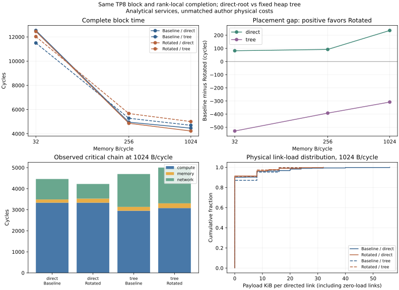
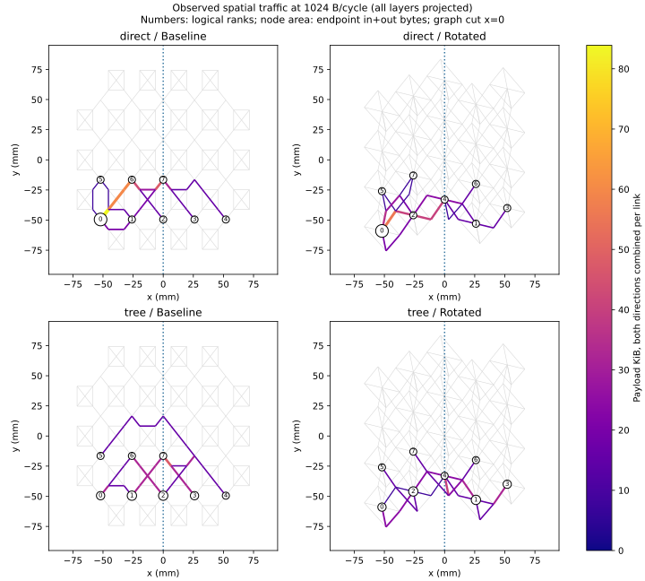

# 固定 Binary-tree AllReduce：空间流量与应用结果

**同一 TP8 block、相同 mapping 和资源参数下，collective algorithm 改变了两个
placements 的排序：direct-root 的三个点均是 Rotated 更快；固定 heap tree 的三个点
均是 Baseline 更快。Tree 分散了端点和内存压力，但其串行通信深度可能抵消这些收益。**

本阶段只新增 6 个 tree arms，复用已验收的 6 个 direct-root arms。
130 项测试通过，12 个 cells 的双网络后端重新独立审计通过，420 项源结果产物
哈希一致。没有重跑旧 direct 仿真或完整 Llama，也没有改变 BookSim 内核。

## 1. 对照与守恒

固定完整八头 TP8 Transformer forward：batch 1、sequence 16、hidden 64、FFN 128，
114 operations / 216 data objects / 557,056 MACs。固定 row-major、seed 1、容量、
compute 服务率、WoW 网络参数及 rank-local publication。内存只取既有的
32 / 256 / 1024 B/cycle 三点。每个点只比较 algorithm × placement。

Tree 属于 `ExecutionPolicy.binary_tree_sum`，不进入 logical workload。
对 communicator 中的位置 i，parent 为 floor((i−1)/2)。因此 rank 7 的 parent
是 rank 3。逻辑树不读取坐标、topology 或性能。内部节点等待 children 的完整
contributions，与本地输入相加，写入 partial 后再读出并上送；root 写最终结果，
随后沿相同边向下广播。每个 rank 在自己的最终写入完成后可继续，所有 actions
结束才退役。Partial、输入和内部广播所需输出都受到既有生命周期规则保护。

| 完整 block 中两次 AllReduce | Direct-root | Binary-tree |
|---|---:|---:|
| 逻辑 network bytes | 114,688 | 114,688 |
| Messages / native flits | 28 / 84 | 28 / 84 |
| 含 2000-byte flit padding 的 wire bytes | 168,000 | 168,000 |
| Scalar adds | 14,336 | 14,336 |
| Collective memory read+write bytes | 303,104 | 352,256 |
| 最忙区域的 collective memory bytes | 188,416 | 81,920 |

每次 collective 均满足 `2(P−1)D` network bytes 和 `(P−1)N` adds。
Tree 的 rank 1、2、3 各有独立 partial；每个多一次 D-byte write/read。
两次 collective 因而多 49,152 memory bytes。这些成本已执行和审计，未为了匹配
总成本而删除。**算法相同逻辑语义和通信量，不等于相同内存访问量、空间分布或并行度。**

测试沿实际生成的 action 依赖传播独立数值，检查各输出与全 rank SUM 一致，并覆盖
2/3/5/8 ranks、非连续 rank ID、改变物理端点绑定、提前发布、partial 存活及容量不足。
求和结合顺序会改变；不主张浮点逐 bit 等价。

## 2. 应用完成时间

单位 cycles；B−R 为正表示 Rotated 更快。

| Memory B/cycle | Direct B | Direct R | Direct B−R | Tree B | Tree R | Tree B−R |
|---:|---:|---:|---:|---:|---:|---:|
| 32 | 12,534 | 12,452 | +82 | 11,500 | 12,028 | −528 |
| 256 | 4,954 | 4,862 | +92 | 5,278 | 5,670 | −392 |
| 1024 | 4,461 | 4,225 | +236 | 4,697 | 5,005 | −308 |

32 时，tree 缩短两种 placements 的时间；256/1024 时，两种 placements 都是 direct
更快。不能把 tree 的减小热点效果解释成始终缩短应用时间，也不能沿用 direct 的
placement 排名预测 tree。

[可导出 PDF](figures/algorithm_comparison.pdf)。折线连接三个注册点，不表示测得连续阈值。

## 3. 空间流量的变化

统计基于每个 flit 的真实路径：按源 flit-ID 顺序为最后一片分配剩余有效载荷，
另计完整 wire bytes；允许各 flit 路径不同。Hops 只数 inter-router traversals。
端点 max/mean 的分母是 8 个 active endpoints；链路使用 directed resources，
完整分布包含零流量链路。图中的空间线宽则合并两个方向，并明确标注。

| 1024 B/cycle | Direct B | Direct R | Tree B | Tree R |
|---|---:|---:|---:|---:|
| 最大端点 in+out payload bytes | 114,688 | 114,688 | 49,152 | 49,152 |
| 端点 max/mean | 4.000 | 4.000 | 1.714 | 1.714 |
| 最大 directed-link payload bytes | 57,344 | 32,768 | 24,576 | 24,576 |
| 最大 directed-link wire bytes | 84,000 | 48,000 | 36,000 | 36,000 |
| Payload byte-hops | 688,128 | 475,136 | 688,128 | 442,368 |
| Wire byte-hops | 1,008,000 | 696,000 | 1,008,000 | 648,000 |

Tree 将端点最大流量从 root 的 114,688 B 降至内部 rank 1/2 的 49,152 B。
它也把最忙区域的 collective memory traffic 从 root 的 188,416 B 分散到内部节点，
尽管总内存服务量反而增加。这里 volume concentration 是测得的工作分布，不是利用率。

Baseline 的 tree byte-hops 与 direct 相同，Rotated 则进一步减少。但 Tree Rotated
的应用时间仍更长。**总传输工作和最长依赖链上的传输工作必须分别观察。**

[空间图 PDF](figures/spatial_projection.pdf)。全部层投影到同一平面；灰线为物理连接，
颜色/线宽为两方向合计有效载荷，圆点大小为 endpoint in+out，数字为 logical rank。
它不是布线签核图；重叠层上的不同链路仍在原始统计中分别计数。

## 4. 为什么排序改变：关键通信的位置与依赖深度

观察关键链的 compute / memory / network 服务周期如下；每行三项相加为应用时间。
这些是观测记账，不是三个独立干预的因果贡献；工作总量不因选中的链变化而变化。

| Memory | Direct B C/M/N | Direct R C/M/N | Tree B C/M/N | Tree R C/M/N |
|---:|---:|---:|---:|---:|
| 32 | 3080/9040/414 | 3080/9040/332 | 2824/7504/1172 | 2824/7504/1700 |
| 256 | 3336/986/632 | 3336/1018/508 | 3080/858/1340 | 3080/890/1700 |
| 1024 | 3336/153/972 | 3336/193/696 | 2952/185/1560 | 3080/225/1700 |

### 32 B/cycle：内存分布收益抵消通信深度

Tree Baseline 相对 direct 的关键链：compute −256、memory −1536、network +758，
总共缩短 1034 cycles。Rotated 中 network 增加 1368，最终只缩短 424 cycles。
因此低带宽时算法差异并非一定很小：分散同一种受限资源的压力本身就能获益。

Tree 两种 placements 的关键分支均为 `7→3→1→0`，再 `0→1→3→7`。
各方向三条传输的实测服务时间分别是：

- Baseline：81、140、72 cycles；单向合计 293。
- Rotated：173、88、164 cycles；单向合计 425。

两次 AllReduce、每次上下两方向，使差距为 `4×(425−293)=528 cycles`，
恰好等于两种 tree 应用时间差。这里 compute 和 memory 的关键链服务总量相同；
差异来自固定树关键分支在两种物理网络上的执行时间。

### 1024 B/cycle：更低均值/byte-hops 并未缩短关键分支

Tree Rotated 平均 message 时间为 114.786 cycles，低于 Baseline 的 136.571；
但它仍由三层路径 `7→3→1→0` 控制，每次 collective 的关键 network 服务为
`173+88+164+164+88+173=850 cycles`。

此时 Tree Baseline 的关键分支转为 `5→2→0→2→5`，每次为
`249+140+142+249=780 cycles`。两次 collective 的 network 差为 140 cycles，
加上选定链的 compute 差 128 和 memory 差 40，总计 308 cycles。

Direct-root 在同一点的关键 network 服务却是 Baseline 972、Rotated 696，
因此 Rotated 的路径优势可以体现为 236-cycle 应用收益。换成 tree 后，关键的是
多段逻辑边的依赖串接；总 byte-hops 更低，并不保证这条串行分支更短。

256 点同样由关键分支选择解释：Tree Baseline 的 reduce 沿 rank 7 分支，broadcast
尾部转到 rank 5；Rotated 仍由 rank 7 分支控制。关键链差为 network 360 + memory 32，
总计 392 cycles。这不是新增调度策略造成的变化。

## 5. 中央 cut：提供空间约束，当前不是瓶颈证据

使用固定 graph partition：导出的 router 中心 x<0 为左，x>=0 为右，包含所有层。
已检查 pinned WoW visualizer，export 的 position 就是中心，不额外加半个 reticle 尺寸。
每次实际跨边遍历都计入，重复穿越不丢弃；不能只按源/目的分居两侧的消息数计费。

| 所有三个带宽点均相同 | Direct B | Direct R | Tree B | Tree R |
|---|---:|---:|---:|---:|
| 两方向合计 cut payload bytes | 65,536 | 65,536 | 81,920 | 49,152 |
| 两方向合计 cut wire bytes | 96,000 | 96,000 | 120,000 | 72,000 |
| 单方向 cut capacity，B/cycle | 16,000 | 52,000 | 16,000 | 52,000 |
| max(direction ceil(wire/capacity))，cycles | 3 | 1 | 4 | 1 |

两方向独立计算，不能把单方向流量除以双向容量。这里下界只有 1–4 cycles，
远小于应用时间，且 tree Rotated 的 cut 流量更低却应用更慢。当前结果不支持
“中央 cut 已饱和”或“bisection 决定排名”。它揭示的是流量投影确实改变了 cut 需求。

Tree 三点的 first-flit injection wait 均为 0，最多 4 个在途 messages；
first-injected-flit 的 router 驻留超额总计 Baseline 为 0/4/12，Rotated 为 2/2/14 cycles。
这些小值也不支持将本次主要差异归因为网络饱和。任意单一 cut、平均 latency 或
最大 integrated link load 都不能替代依赖与实际计时。

## 6. 证据、范围和后续

- [完整数表](analysis/comparison.csv)、[分析验收](analysis/ANALYZED.json)、
  [每 rank 发布、关键传输与资源明细](analysis/MECHANISMS.json)、
  [130 项测试](validation/SEMANTICS.json)。运行源码 `7cff8ad`，独立分析 `7f4e41f`；
  原生二进制/输入/环境身份见 [STARTED](run/STARTED.json)。
- 6 个 direct cells 来自 `runs/collective-memory-balance-001`；新实验在
  `runs/collective-tree-spatial-001`；全部事件、directed-link distributions 和完整链在
  `runs/tree-spatial-attribution-001`。均位于 eex005 的
  `/home/wangziheng/wafer_simulator`。图表在 `runs/tree-spatial-figures-001`。
  大表留在服务器，清单记录哈希；已有 direct 证据未改写。
- 复用 direct 前核对了 logical workload、tensors、operators、mapping、target、timing、
  network export、seed、运行策略、native binaries 和软件环境，唯一策略差异为 algorithm。
  当前绑定重新通过旧 direct 的逐阶段 timing/lifetime/work audit。
- 固定小 tensor、whole-tensor store/reload、全输入就绪才入 collective、单 seed、
  未标定 compute/SRAM、未匹配网络物理成本仍是范围条件。没有 claim 原生训练时间、
  数值逐 bit 等价、tree 普遍更优或 topology-independent ranking。

这一阶段支持的架构结论是：**相同 collective 语义、相同通信量和总加法量，可以因
空间组织和串行关键分支不同，改变 placement 的应用排序。需要把资源分布和依赖计时
一起建模；单看热点是否分散、总 byte-hops 或 cut volume 会错过本例的决定因素。**

后续可先拆分 active endpoint selection 与 logical rank assignment，再用同一组
物理端点做有界的 topology × mapping × algorithm 对照；本阶段未开展该扩展。
